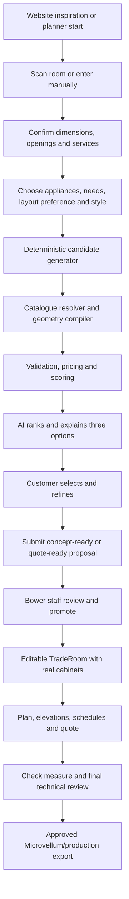

# AI Kitchen Designer and Room Scanner Implementation Plan

**Status:** Proposed canonical implementation plan for the next AI Designer build.
Revision 3: review findings incorporated on 2026-07-14. This revision adds exact sink and
appliance contracts, stage-specific readiness gates, immutable catalogue/pricing snapshots,
rule ownership, model/prompt lineage, safe room-patch guidance and corrected implementation
estimates. Section 3 remains the two-pass repository audit and Section 23 remains the D0
repair appendix.
Revision 4: seed parameter values researched for the kitchen rule pack from Australian
regulatory sources (AS/NZS 5601.1:2022 overhead clearances via Energy Safe Victoria GIS 25,
AS/NZS 3000:2018 wet-area zones, NCC 2022 Livable Housing Design Standard) and NKBA kitchen
planning guidelines (new Section 7.4.7); a new electrical-zone rule `KRN-ELEC-001` added to
7.4.4; Section 8.3 API-migration guidance re-verified current as of 2026-07; sources added
to Section 22.

**Last code review:** 2026-07-14 (two passes).

**Planner:** `bower-kitchen-planner`

**Website:** `bower-cabinet-web-site`

## 0. Executive Decision

Build the improved designer as a constrained design system around the existing kitchen
planner, not as an AI that directly invents cabinet geometry or production data.

The recommended flow is:

1. A customer scans or manually enters the room.
2. A person confirms the dimensions, openings and services.
3. The customer nominates required appliances, layout preferences, style, colours and
   materials.
4. Deterministic code generates and validates a pool of feasible cabinet layouts using
   Bower's real planner catalogue.
5. AI ranks, explains and refines those controlled options.
6. The selected option is compiled again on the server and converted into an editable
   `TradeRoom` containing real `ConfiguredCabinet` records.
7. Bower staff review the design before quote-ready documents are issued.
8. A separate check-measure and approval gate remains mandatory before manufacturing or
   Microvellum export.

The room scanner supplies trusted room facts. The AI supplies design judgement and a
friendly interface. The deterministic engine remains responsible for cabinet selection,
placement, validation, pricing and document dimensions.

## 1. Document Authority

This document is authoritative for the next version of the AI kitchen designer, including:

- customer design briefs;
- cabinet-layout generation and refinement;
- catalogue and material resolution;
- scanner-to-designer use;
- homeowner and trade AI experiences;
- conversion to editable trade rooms;
- design, quote and plan outputs; and
- designer quality gates and delivery order.

`AI-ROOM-SCANNER-MASTER-PLAN.md` remains authoritative for:

- room-capture contracts;
- WebXR, RoomPlan, ARCore and vendor adapters;
- capture accuracy;
- scan confirmation and revision rules;
- secure handoffs;
- private photos/artifacts;
- public endpoint security; and
- scan retention.

Where this plan refers to room scans, it must consume the contracts and security rules from
the scanner master plan without weakening them.

This document supersedes `AI-DESIGNER-HARNESS-PLAN.md` for future designer work. That file
and `AI-DESIGNER-BUILD-STATUS.md` are useful history, but both are physically truncated and
contain stale statements about deployment and current wiring.

## 2. Product Outcome

The target product is an AI-assisted kitchen design workspace that can:

- start from a confirmed room scan or confirmed manual room;
- respect doors, windows, walkways, plumbing, power, gas and hood duct locations;
- capture the household's storage, cooking, appliance, budget and entertaining needs;
- honour a nominated kitchen layout when it fits, or explain why it does not;
- use actual Bower planner cabinets and valid cabinet dimensions;
- apply exact nominated supplier colours/materials where available;
- allow controlled substitutions only when the user permits them;
- produce three meaningfully different, valid design options;
- refine a selected design through typed, undoable operations;
- convert the accepted design into an editable trade room without re-entering cabinets;
- calculate a price band from the existing BOM engine;
- produce a plan, elevations, cabinet schedule, material schedule and quote summary; and
- preserve human review before any production output.

### Product boundary

The system may produce **concept-ready** and **quote-ready** proposals from a confirmed room.
A customer may submit a concept-ready proposal when exact appliance or sink models are still
pending, but it must be labelled for Bower review and cannot issue a quote document. A
quote is issued only after quote-readiness passes and Bower staff review it. The system must
not label a scanner-based design as manufacturing-ready. Manufacturing remains blocked until
Bower completes a check measure, reviews appliance installation requirements, resolves
warnings and approves the trade room.

## 3. Verified Current State

### 3.1 Useful foundations already present

| Capability | Current implementation | Reuse decision |
|---|---|---|
| AI design DSL | `src/lib/layout/types.ts`, `schemas.ts` | Extend, do not replace wholesale |
| Deterministic compiler | `compileSpec.ts`, `solveRun.ts`, `geometry.ts` | Keep as the geometry core |
| Layout validation | `validate.ts` | Expand into quote and production readiness levels |
| Four layout strategies | single wall, L, U and galley | Use as candidate families |
| No-AI fallback | `defaultSpecFor()` | Keep as the guaranteed fallback |
| AI endpoint | `supabase/functions/ai-designer/index.ts` | Replace behind a V2 feature flag or versioned endpoint |
| AI homeowner UI | `StepDesign.tsx`, `useAiDesigner.ts` | Extract into a reusable design workspace |
| 3D preview | `UnifiedScene` | Keep for homeowner option review |
| Trade 3D planner | `RoomPlanner`, `PlannerScene` | Destination for accepted designs |
| BOM pricing | `generateQuoteBOM`, `useWizardPricing` | Remain the pricing source of truth |
| Cabinet catalogue | `microvellum_products`, `useCatalog` | Add capabilities and deterministic resolution |
| Supplier materials | `planner-materials.json`, `useMaterialsCatalog` | Use exact stable IDs and DB cost overlay |
| Website style journey | flat-lay generator and `planner_handoffs` | Upgrade the handoff to carry exact IDs |
| Room scan contract | `src/lib/roomScan/contract.ts` | Consume only confirmed scan geometry |
| Plan PDF | `src/lib/planViewPdf.ts` | Extend with room features and elevations |
| Quote/shop outputs | quote PDF, ordering, packing, cut summary, Microvellum XML | Reuse after trade conversion and approval |
| Placement sweep | `npm run ai:sweep` | Extend with V2 catalogue and conversion checks |

The existing placement sweep covers 45,360 combinations and is a valuable regression base.
It proves the current deterministic engine is useful, but it does not prove that AI output,
catalogue resolution, trade conversion, exact material selection or production documents are
correct.

### 3.2 Critical gaps found

| Priority | Finding | Why it matters | Required repair |
|---|---|---|---|
| P0 | Homeowner AI output is saved as `spec` and generic `items`, while trade and Microvellum paths require `design_data.tradeRooms` | Converting a lead only changes its status; it does not create an editable cabinet job | Add a deterministic, server-verified proposal-to-`TradeRoom` promotion path |
| P0 | `finalize` accepts raw specs without proving that those exact specs passed `propose_layout` with zero errors | The prompt states a safety rule that the server does not enforce | Finalize only server-issued proposal IDs/hashes that passed validation |
| P0 | The wizard's `roomShape` is actually a cabinet-layout choice, but L/U layouts are also rendered as an L-shaped physical room | Scanner room geometry and cabinet layout strategy are being conflated | Separate `roomGeometry.shape` from `layoutPreference` everywhere |
| P0 | `buildBrief()` hard-codes 2700 mm height and synthesizes depth for single-wall designs | Confirmed scan height/depth can be discarded or replaced | Build the brief directly from the confirmed canonical room |
| P0 | AI `patch_room` mutates server brief state immediately; client wiring applies only openings/services, not width/depth | Room facts can diverge and confirmed scans can be changed without reconfirmation | Return a proposed room patch, invalidate confirmation, and block design until reconfirmed |
| P0 | Current role resolution maps nine broad roles to static template IDs | The AI does not reliably use the real available Bower cabinet variants | Add catalogue capability metadata and a deterministic resolver |
| P0 | Website handoff carries material names rather than stable catalogue IDs | Similar names can map to the wrong finish, substrate or supplier row | Introduce a versioned exact-ID material selection contract |
| P0 | Server finalize compiles finalized specs but does not filter options with error-severity violations, and `StepDesign.tsx` surfaces only `warn`-severity counts to the customer | A design with hard geometry errors can be displayed and selected with no visible flag — worse than the finalize bypass alone | Reject error-severity options server-side after the final compile AND display any residual errors prominently in the option UI |
| P0 | The website still writes `planner_handoffs` through a direct anonymous REST insert (`dreamweaverBridge.ts` `createPlannerHandoff()`), even though the planner repo already ships a tokenized `create-planner-handoff` Edge Function | Violates the scanner master plan's secure handoff flow (§6.3) and this plan's §15; the deployed Edge Function is dead code until the website calls it | Switch `createPlannerHandoff()` to call the `create-planner-handoff` Edge Function and open `/wizard?handoff=<id>#handoffToken=<token>` |
| ~~P0~~ Largely repaired | ~~Homeowner submit still builds a partial `roomScan` stamp and directly inserts a job~~ Verified 2026-07-14: `Wizard.tsx` now builds a schema-validated `ConfirmedRoomScanV1` and submits through the atomic `submit-planner-enquiry` Edge Function with a durable `submissionKey` | Residual issues only: the scan candidate rebuilds `room` with a hard-coded 2700 mm height (an incoming scan's measured height is discarded), and a scan that fails validation is silently omitted (`console.warn`) rather than surfaced | Carry incoming confirmed-scan height/geometry through unchanged; surface scan-omission as a visible warning; fold the height fix into the `buildBrief()` repair above |
| P1 | `StyleSpec` covers exterior finish, benchtop and handle (plus optional `kickId`/`tapId`) | Door profile, secondary colour, carcase and splashback are lost entirely; kick/tap are optional and unenforced | Add a richer style selection contract |
| P1 | The requested layout shape is fixed before generation | Three AI options can be variations inside the same strategy instead of the best feasible alternatives | Deterministically enumerate allowed strategies, then rank diverse options |
| P1 | Island `features` are stored but not compiled into actual sink/seating/storage behaviour | The preview can claim features that geometry does not implement | Compile each island feature or reject it |
| P1 | There is no reusable trade-side AI panel | Staff cannot use AI to create or improve a real job | Add a shared design workspace with preview, locks, diff and apply |
| P1 | Plan PDF lacks scanner openings/services and there is no wall-elevation design pack | The generated plan is incomplete for review and quoting | Build a deterministic multi-page design pack |
| P1 | Model calls, prompts, revisions and staff corrections are not durably evaluated | Quality cannot be measured or safely improved | Add versioned proposal records, local golden tests and outcome events |
| P2 | The old designer plan proposes learning/trends before the conversion path is complete | It adds complexity before the base product is trustworthy | Defer automated learning until real staff-reviewed outcomes exist |

### 3.3 Deployment statement to verify before implementation

The latest handover contains both "deployed" and "redeploy required" statements for
`ai-designer`. Treat code presence and production deployment as separate facts. Before the
V2 pilot, record the deployed function version, model, prompt version and a successful live
request. Do not infer production state from the repository alone.

Specifics from `HANDOVER-2026-07-14.md` still pending as of that date:

- redeploy `ai-designer` (`supabase functions deploy ai-designer --use-api --no-verify-jwt`)
  to pick up the boot-crash fix and client-selections prompt;
- set production `VITE_PLANNER_URL` in the website build environment (links otherwise fall
  back to localhost); and
- commit the regenerated `supabase/functions/_shared/layout/*` in both repos.

Current repository default: OpenAI Chat Completions, `gpt-4o` unless overridden by
`OPENAI_MODEL`, `tool_choice: 'required'`, and `MAX_TOOL_ROUNDS = 8`. This is not evidence of
the deployed production model. Record the live value only after a successful production
request identifies the deployed function version, model and prompt version.

### 3.4 Code-verification audit (2026-07-14, second pass)

Every Section 3.2 finding was re-verified directly against both repositories. Results:

| Finding | Status | Primary evidence |
|---|---|---|
| `finalize` accepts raw specs | Confirmed, and worse than stated | `ai-designer/index.ts:251-252` assigns `finalized = input`; the final compile loop (`:264-276`) drops schema-invalid specs but pushes options regardless of error-severity violations |
| Error-severity options reach the customer | New finding | `StepDesign.tsx:200-202` renders only `severity === 'warn'` counts; errors are invisible |
| `patch_room` mutates immediately | Confirmed | `ai-designer/index.ts:248-250` merges the patch into `brief.room` in the same turn; `StepDesign.tsx:145-146` applies only `openings`/`services` client-side |
| `roomShape` conflation | Confirmed | `wizardBrief.ts:14` types `roomShape` as `LayoutShape`; `StepDesign.tsx:93-96` fabricates an `LShape` scene room with synthesized 50% cutouts for L/U layouts (added deliberately per `HANDOVER-2026-07-14.md`, "L-shape shows an L-shaped room") |
| `buildBrief()` hard-codes room facts | Confirmed | `wizardBrief.ts:43-45` synthesizes depth for single-wall; `:57` hard-codes `height: 2700`; `Wizard.tsx:651` repeats the 2700 hard-code in the submitted scan |
| Static role resolution | Confirmed | `catalogRoles.ts:19-29`: nine `SegmentRole`s to fixed `STATIC_LIBRARY_TEMPLATES` ids |
| Website handoff carries names only | Confirmed | `dreamweaverBridge.ts` `WebsitePlannerHandoff.materials` is name strings; `FlatLayGeneratorPage.tsx:368` sends `mainFinish?.name` despite `FlatLayCatalogItem` having a stable `id` |
| Website direct anon insert | New finding | `dreamweaverBridge.ts:273` POSTs directly to `/rest/v1/planner_handoffs`; no website code calls the existing `create-planner-handoff` Edge Function |
| Lead conversion changes status only | Confirmed | `Leads.tsx:87-96` `convertToJob()` runs `.update({ status: 'draft' })` and nothing else |
| Homeowner submit bypasses secure path | Stale — largely repaired | `Wizard.tsx:626-723` builds a schema-valid `ConfirmedRoomScanV1` and calls `submit-planner-enquiry` with a durable `submissionKey`; residuals noted in 3.2 |
| Scanner master plan authority | Confirmed present | `docs/AI-ROOM-SCANNER-MASTER-PLAN.md` (1,315 lines) defines Phase 1A-min/1B, `ConfirmedRoomScanV1`, and the secure handoff flow this plan consumes |
| Placement sweep | Confirmed | `scripts/ai-planner-sweep.mjs` via `npm run ai:sweep`; 45,360 combos, 0 defects per the handover. The `design:*`/`test:design-*` scripts in Section 16.1 do not exist yet — they are proposals |

Temporary development-environment and deployment constraints belong in the dated handover,
not in this canonical implementation plan. Implementers should consult the current handover
before committing, deploying or diagnosing environment-specific file-mount behaviour.

## 4. Target Customer-to-Production Journey



### Required customer choices

The customer should be able to nominate each choice as one of:

- `required`: do not change without asking;
- `preferred`: keep where feasible and explain substitutions; or
- `open`: the designer may recommend an option.

This applies to layout strategy, island, appliances, cabinet functions and material/style
selections. A required choice that cannot fit should produce a clear conflict, not a silent
compromise.

## 5. Architecture Principles

1. **Room facts are not design suggestions.** Confirmed dimensions, openings and services
   come from the room contract and cannot be silently changed by AI.
2. **AI expresses intent, not production geometry.** The model selects strategies and typed
   operations. Deterministic code owns positions, dimensions and catalogue resolution.
3. **Exact selections remain exact.** Stable catalogue IDs are preserved through website,
   planner, job, quote and production records.
4. **Every displayed option is reproducible.** A proposal records room revision, brief
   revision, engine version, catalogue version, pricing version and a fingerprint.
5. **Every displayed option passed server checks.** The server, not the prompt, enforces
   schema, catalogue, geometry and pricing requirements.
6. **A room edit invalidates designs.** A changed confirmed room creates an unconfirmed room
   revision and marks existing proposals stale until reconfirmed and recompiled.
7. **A style edit does not invalidate room confirmation.** It increments the design/style
   revision and triggers render/pricing updates only.
8. **Customer and trade surfaces share one core.** UI can differ, but compilation,
   validation, catalogue resolution and pricing cannot fork.
9. **AI output never directly becomes production data.** Staff promotion recompiles and
   validates before writing `tradeRooms`.
10. **Warnings have owners and gates.** A warning must state whether it needs customer
    confirmation, designer review, check measure or a licensed trade decision.

## 6. Target Contracts

The names below are proposed. Final Zod schemas should live beside the existing layout
schemas and be mirrored into the Edge Function through the existing sync workflow.

### 6.1 Room input

Use `ConfirmedRoomScanV1.room` when a confirmed scan exists. For manual entry, produce the
same confirmed room shape through the editor rather than maintaining a second weaker room
contract.

```ts
type DesignerRoomInput = {
  room: RoomSpecV1;
  source: "confirmed-scan" | "confirmed-manual";
  roomRevision: number;
  scanSource?: RoomScanSourceV1;
  confidence?: ConfidenceV1;
  normalizationWarnings?: string[];
};
```

The designer does not receive `adapterState`. Private scan photos are excluded by default.
If an approved future vision feature uses a photo, it receives a short-lived signed URL and
may suggest context only. It must never override confirmed measurements.

### 6.2 Design brief V2

```ts
type RequirementStrength = "required" | "preferred" | "open";

type LayoutStrategy = "single-wall" | "l-shape" | "u-shape" | "galley";

type ProductIdentityV2 = {
  catalogId: string | null;
  brand: string | null;
  modelNumber: string | null;
  name: string;
};

type ProductDataStatusV2 = "exact-model" | "customer-measured" | "bower-provisional";

type ApplianceKindV2 =
  | "dishwasher"
  | "cooktop"
  | "oven"
  | "freestanding-cooker"
  | "rangehood"
  | "fridge"
  | "microwave"
  | "coffee-machine"
  | "wine-fridge";

interface ApplianceRequirementV2 {
  requirementId: string;
  kind: ApplianceKindV2;
  strength: RequirementStrength;
  product: ProductIdentityV2 | null;
  dataStatus: ProductDataStatusV2;
  quantity: number;
  envelope: {
    applianceWidthMm: number;
    applianceHeightMm: number;
    applianceDepthMm: number;
    openingWidthMm: number;
    openingHeightMm: number;
    openingDepthMm: number;
    clearanceLeftMm: number;
    clearanceRightMm: number;
    clearanceTopMm: number;
    clearanceRearMm: number;
    clearanceFrontMm: number;
    doorSwingClearanceMm: number;
  };
  installation: "freestanding" | "built-in" | "integrated" | "underbench";
  services: Array<"water-supply" | "drain" | "gpo" | "gas" | "hood-duct">;
  sourceReference: string | null;
}

interface SinkRequirementV2 {
  requirementId: string;
  strength: RequirementStrength;
  product: ProductIdentityV2 | null;
  dataStatus: ProductDataStatusV2;
  installation: "top-mount" | "undermount" | "flush-mount" | "farmhouse";
  bowlCount: number;
  overallWidthMm: number;
  overallDepthMm: number;
  bowlDepthMm: number;
  cutoutWidthMm: number | null;
  cutoutDepthMm: number | null;
  minimumBaseInternalWidthMm: number | null;
  clipAndRailClearanceMm: number | null;
  wasteOutletFromLeftMm: number | null;
  sourceReference: string | null;
}

interface DesignBriefV2 {
  schemaVersion: 2;
  roomInput: DesignerRoomInput;
  household: {
    size?: number;
    cooks?: "rare" | "daily" | "entertainer";
    accessibilityNotes?: string;
  };
  priorities: Array<{
    value: "storage" | "bench-space" | "entertaining" | "baking" | "budget";
    strength: RequirementStrength;
  }>;
  appliances: ApplianceRequirementV2[];
  sink: SinkRequirementV2;
  layoutPreference: {
    strength: RequirementStrength;
    preferred?: LayoutStrategy;
    allowed: LayoutStrategy[];
    island: { strength: RequirementStrength; value: "want" | "no" | "if-it-fits" };
  };
  style: StyleSelectionV2;
  budgetBand?: "value" | "mid" | "premium";
  notes?: string;
  briefRevision: number;
}
```

Exact-model records should be populated from approved manufacturer or catalogue data. A
customer-measured or Bower-provisional envelope can support concept generation, but its
`dataStatus` keeps quote readiness pending until Bower confirms the model and installation
data. Sink fit uses the complete `SinkRequirementV2` envelope, not bowl count or nominal sink
width alone. Product installation clearances remain explicit data, never facts invented by
the model.

For strict AI tool schemas, nullable fields remain required keys with `null` as the unknown
value. Internal Zod schemas may transform trusted legacy inputs, but the server must reject
negative dimensions, zero quantities, unknown service types and exact-model records that omit
their source reference.

### 6.3 Exact material/style selection

```ts
interface CatalogMaterialRefV2 {
  catalogId: string;
  itemCode?: string;
  brand?: string;
  name: string;
  role:
    | "primary-front"
    | "secondary-front"
    | "carcase"
    | "benchtop"
    | "splashback"
    | "handle"
    | "kick"
    | "tap";
  strength: RequirementStrength;
  substitutionPolicy: "exact-only" | "same-range" | "closest-approved";
}

interface StyleSelectionV2 {
  presetId?: string;
  styleTags: string[];
  doorProfileId?: string;
  materials: CatalogMaterialRefV2[];
  notes?: string;
}
```

The ID is authoritative. Name and brand are display/audit fields. If the ID is unavailable,
the resolver follows the declared substitution policy and records the result for approval.

### 6.4 AI design intent

The model should express cabinet needs without selecting arbitrary database rows.

```ts
type CabinetRoleV2 =
  | "sink-base"
  | "cooktop-base"
  | "dishwasher-opening"
  | "drawer-base"
  | "door-base"
  | "bin-base"
  | "corner-base"
  | "wall-storage"
  | "rangehood-wall"
  | "open-shelf"
  | "pantry-tall"
  | "oven-tower"
  | "appliance-tower"
  | "fridge-opening"
  | "filler"
  | "end-panel";

interface CabinetIntentV2 {
  intentId: string;
  role: CabinetRoleV2;
  wall: WallIdV1 | "island";
  sequence: number;
  targetWidthMm?: number;
  strength: RequirementStrength;
  storageFunction?: "cutlery" | "pots" | "pantry" | "bins" | "general";
  applianceRef?: string;
  locked?: boolean;
}

interface DesignIntentV2 {
  strategy: LayoutStrategy;
  cabinetIntents: CabinetIntentV2[];
  island?: {
    requestedLengthMm?: number;
    features: Array<"storage" | "seating" | "sink">;
  };
  rationalePoints: string[];
}
```

### 6.5 Compiled proposal

```ts
type ValidationStageV2 = "concept" | "quote" | "production";

interface ValidationStageResultV2 {
  stage: ValidationStageV2;
  status: "pass" | "fail" | "pending";
  evaluatedAt: string;
  evaluatorVersion: string;
  rulePackVersion: string;
  blockerRuleIds: string[];
  warningRuleIds: string[];
  resultFingerprint: string;
}

interface ProposalReadinessV2 {
  concept: ValidationStageResultV2;
  quote: ValidationStageResultV2;
  production: ValidationStageResultV2;
}

interface DesignProposalV2 {
  proposalId: string;
  proposalFingerprint: string;
  roomRevision: number;
  briefRevision: number;
  designRevision: number;
  engineVersion: string;
  catalogVersion: string;
  catalogSnapshotId: string;
  catalogSnapshotHash: string;
  capabilityMapVersion: string;
  materialBundleVersion: string;
  pricingVersion: string;
  pricingSnapshotId: string;
  pricingSnapshotHash: string;
  rulePackVersion: string;
  ruleResults: KitchenRuleResultV1[];
  ruleResultsFingerprint: string;
  modelTrace: {
    provider: "openai";
    modelId: string;
    modelSnapshot: string | null;
    promptVersion: string;
  } | null;
  intent: DesignIntentV2;
  resolvedSpec: KitchenSpecV2;
  items: PlacedItem[];
  priceBand: PriceBand;
  score: DesignScoreV2;
  violations: ViolationV2[];
  substitutions: MaterialSubstitutionV2[];
  rationale: string;
  readiness: ProposalReadinessV2;
  workflowStatus:
    | "candidate"
    | "customer-selected"
    | "submitted"
    | "promoted"
    | "staff-reviewed"
    | "stale";
}
```

Workflow status and validation readiness are separate. Apply these gates:

- display/select requires `readiness.concept.status === "pass"`;
- customer submission requires concept pass and may be labelled either concept-ready or
  quote-ready;
- staff promotion to a draft `TradeRoom` requires concept pass and carries unresolved quote
  blockers into the trade workspace;
- issuing a quote requires quote pass plus staff review;
- Microvellum/production export requires production pass plus staff approval; and
- any old room or brief revision makes the proposal stale and blocks submission, promotion,
  quote issue and export.

Concept, quote and production evaluations must all be present. Stages that cannot yet run are
stored as `pending`, not omitted. A proposal with a concept blocker cannot be displayed as
selectable. A quote blocker may remain on a promoted draft room, but it must visibly block
quote issue until staff resolve or formally except it under the rule policy.

Compute `proposalFingerprint` from canonical deterministic data: room/brief revisions,
intent, resolved specification, placed-item geometry, snapshot hashes, rule-pack version and
rule-results fingerprint. Exclude timestamps, workflow status and AI rationale text so the
same controlled design produces the same fingerprint. Store AI model/prompt identity in
`modelTrace` for explanation provenance without making deterministic replay depend on prose.

### 6.6 Typed refinement operations

Free-form chat should be translated into a small operation set and then applied by code:

- `move_role`;
- `add_role`;
- `remove_role`;
- `set_role_width`;
- `set_layout_strategy`;
- `set_island`;
- `set_material`;
- `set_door_profile`;
- `lock_component`;
- `unlock_component`; and
- `propose_room_patch`.

```ts
type ProposedRoomChangeV2 =
  | { kind: "set-dimension"; field: "width" | "depth" | "height"; valueMm: number }
  | { kind: "upsert-opening"; opening: OpeningV1 }
  | { kind: "remove-opening"; openingId: string }
  | { kind: "upsert-service"; service: ServicePointV1 }
  | { kind: "remove-service"; serviceId: string };

interface ProposedRoomPatchV2 {
  baseRoomRevision: number;
  changes: ProposedRoomChangeV2[];
  reason: string;
}

type DesignOperationV2 =
  | { operationId: string; type: "move_role"; intentId: string; wall: WallIdV1 | "island"; sequence: number }
  | { operationId: string; type: "add_role"; intent: CabinetIntentV2 }
  | { operationId: string; type: "remove_role"; intentId: string }
  | { operationId: string; type: "set_role_width"; intentId: string; widthMm: number }
  | { operationId: string; type: "set_layout_strategy"; strategy: LayoutStrategy }
  | { operationId: string; type: "set_island"; island: DesignIntentV2["island"] | null }
  | { operationId: string; type: "set_material"; material: CatalogMaterialRefV2 }
  | { operationId: string; type: "set_door_profile"; doorProfileId: string | null }
  | { operationId: string; type: "lock_component"; intentId: string }
  | { operationId: string; type: "unlock_component"; intentId: string }
  | { operationId: string; type: "propose_room_patch"; patch: ProposedRoomPatchV2 };
```

Every union member receives a strict discriminated Zod schema. Widths and sequence values are
range checked before evaluation; referenced intent/entity IDs must exist in the proposal base
revision.

`propose_room_patch` is deliberately separate. Applying it increments `roomRevision`, returns
an unconfirmed room and blocks design generation until the person reconfirms it.

## 7. Deterministic Designer V2

### 7.1 Candidate generation before AI ranking

The current AI writes complete run arrays. V2 should first generate feasible candidates in
code:

1. Determine strategies allowed by the room and customer constraints.
2. Enumerate sensible sink, cooktop, fridge and tall-storage wall assignments.
3. Prefer services and windows where appropriate.
4. Add requested appliances and cabinet functions.
5. Solve each run with real catalogue capabilities.
6. Compile geometry.
7. Reject concept blockers and retain quote/production findings.
8. Score soft criteria.
9. Remove near-duplicate candidates.
10. Send the best candidate summaries to AI for ranking and explanation.

This makes option quality less dependent on the model and reduces repeated model-tool repair
rounds.

### 7.2 Catalogue capability resolver

`microvellum_products` has useful dimensions and flags, but the designer needs a normalized
capability view. Add a curated capability layer rather than inferring every role from names
at runtime.

Suggested fields:

- `product_id` / `definition_id`;
- `designer_role`;
- `category`;
- allowed or preferred widths;
- resizable/not resizable;
- door and drawer counts;
- sink/corner/blind/appliance flags;
- compatible appliance type and size;
- wall/base/tall mounting class;
- renderable flag;
- priceable flag;
- customer-visible flag;
- trade-visible flag;
- active catalogue version; and
- priority for deterministic selection.

This can start as a versioned TypeScript/JSON mapping for the small approved cabinet set.
Move it into a table only when admin editing is needed. Do not ask the model to choose from
the entire raw product table.

Resolution order:

1. exact approved product for role and requested width;
2. approved product with the nearest allowed width;
3. approved fallback role product;
4. fail the candidate with `catalog-unresolved`.

Every resolved cabinet must exist, render and price before the proposal is selectable.

### 7.3 Expanded compilation

Extend the existing compiler to handle:

- real wall, base, tall and appliance products;
- left/right corner orientation and second-wall dimensions;
- fillers and end panels as actual output records;
- fridge and dishwasher clear openings;
- oven/appliance tower variants;
- bin and drawer functions;
- requested island storage, seating and sink features;
- wall cabinet height around windows and tall units;
- rangehood/duct relationships;
- cabinet locks during refinement; and
- exact exterior/carcase/hardware material IDs on every output item.

### 7.4 Versioned kitchen rule engine

Kitchen design rules must be executable code and versioned Bower configuration. They must
not exist only in an AI prompt. The AI may request a design intent and explain a result, but
it cannot bypass, rewrite or waive a rule.

Use a rule pack such as `bower-au-kitchen-rules@1.0.0`. Store its version on every proposal,
quote and promoted trade room so an old design can be reproduced after the rules change.

Each rule definition needs:

- a stable rule ID and version;
- category and design phase;
- a named Bower business owner and approver;
- effective/superseded dates and a change reason;
- applicability conditions;
- severity: `blocker`, `warning` or `advisory`;
- Bower-approved parameters rather than unexplained dimensions in source code;
- affected wall, cabinet, appliance, opening and service IDs;
- measured and required values for a useful error message;
- deterministic repair actions in priority order; and
- an optional staff-exception policy with required reason and audit record.

```ts
type KitchenRuleResultV1 = {
  ruleId: string;
  rulePackVersion: string;
  stage: ValidationStageV2;
  severity: "blocker" | "warning" | "advisory";
  status: "pass" | "fail" | "excepted";
  messageKey: string;
  entityIds: string[];
  measured?: Record<string, number | string | boolean>;
  required?: Record<string, number | string | boolean>;
  repairOptions: Array<{
    operation: DesignOperationV2;
    cost: number;
    reason: string;
  }>;
  exception?: {
    staffUserId: string;
    reason: string;
    acceptedAt: string;
  };
};
```

The rule evaluator should run in the same deterministic library in the browser, Edge
Function and tests. The server result remains authoritative.

Rule governance is not a software-only decision:

- the Bower design lead owns functional layout and customer-design rules;
- the Bower production/technical lead approves cabinet, hardware, machining and
  manufacturing rules;
- product clearances must cite approved manufacturer data;
- regulated electrical, gas and plumbing information requires the appropriate qualified
  reviewer and remains guidance until project-specific approval; and
- software changes may implement an approved rule-pack revision but must not silently change
  measurements, severity or exception policy.

Publishing a rule pack requires its deterministic tests, approver, effective date, content
hash and migration note. Old packs remain readable for audit and reproduction.

#### 7.4.1 Core cabinet and corner rules

| Rule ID | Required behaviour | Default result | Deterministic repair order |
|---|---|---|---|
| `KRN-CORNER-001` | Every occupied internal corner must have an approved corner treatment. Prefer a standard corner cabinet when its two-wall envelope fits. | Blocker | Rotate/hand the standard corner; try another approved corner size; use an approved blind-corner cabinet; rebalance adjacent widths; use an approved dead-corner/filler treatment only under policy; reject candidate |
| `KRN-CORNER-002` | A blind-corner cabinet must have the correct hand, door access, blind return, minimum opening and adjacent clearance. | Blocker | Change hand; change adjacent cabinet width/type; add required filler; reject candidate |
| `KRN-CORNER-003` | Drawers, handles, appliance doors and pull-outs beside a corner must open without collision. | Blocker | Add/increase filler; swap drawer for hinged cabinet; move appliance; reject candidate |
| `KRN-WIDTH-001` | Every cabinet width must be an allowed width or an approved resizable range for that exact product. | Blocker | Resolve nearest approved width; redistribute run slack; select approved alternate product; reject candidate |
| `KRN-FILLER-001` | Required wall, corner, handle and scribe clearances must be represented by real fillers/panels, not invisible empty space. | Blocker at quote | Add filler/panel; resize neighbouring cabinets; reject candidate |
| `KRN-END-001` | Every visible cabinet end that requires finishing must have the correct end panel/material. | Warning at concept, blocker at quote | Add matching end panel; change exposure; flag approved exception |

Corner base and corner wall cabinetry must be evaluated separately. A valid base-cabinet
corner does not prove that wall cabinets, doors or rangehoods above it are valid.

#### 7.4.2 Sink, dishwasher and plumbing rules

| Rule ID | Required behaviour | Default result | Deterministic repair order |
|---|---|---|---|
| `KRN-SINK-001` | The sink base must fit the nominated sink's full product envelope: overall body, bowl(s), cut-out, clips/rails, waste and plumbing zone. Bowl count alone is insufficient. | Blocker | Select a larger compatible sink base; use an approved sink-base variant; rebalance adjacent widths; move sink to another valid position; reject candidate |
| `KRN-SINK-002` | Sink placement must not conflict with cabinet dividers, drawers, corner mechanisms, window restrictions or structural obstructions recorded in the room. | Blocker | Change cabinet internals; move sink within compatible base limits; move sink base; reject candidate |
| `KRN-SINK-003` | A sink away from the confirmed water/waste service zone must be identified with distance and routing warning. | Warning, or blocker above Bower limit | Prefer service wall; move sink; record plumbing allowance; require staff exception if beyond configured limit |
| `KRN-DW-001` | A requested dishwasher must be immediately beside the sink cabinet by default, preferably on the same run. | Blocker for public options | Move dishwasher opening beside sink; swap with adjacent cabinet; place on the other side of sink; move the sink group; reject candidate |
| `KRN-DW-002` | Dishwasher opening width/height/depth and panel type must match the nominated appliance and installation method. | Blocker | Select correct opening/panel kit; resize adjacent cabinets; choose approved appliance alternative; reject candidate |
| `KRN-DW-003` | Dishwasher hoses/services must have an approved route that does not rely on an unapproved corner, inaccessible void or excessive run. | Blocker at quote | Change side; add approved service route; move dishwasher; require documented staff exception |
| `KRN-BIN-001` | Prefer the waste/bin cabinet in the sink/preparation zone without displacing a required dishwasher. | Advisory or brief-dependent warning | Place beside sink/prep zone; select compatible under-sink bin; retain as scored trade-off |

If a dishwasher cannot be adjacent to the sink, the public planner must not silently produce
that design. It may present another valid layout. A non-adjacent installation is a staff-only
exception when Bower's configured plumbing policy allows it.

#### 7.4.3 Cooking, refrigeration and appliance rules

| Rule ID | Required behaviour | Default result |
|---|---|---|
| `KRN-COOK-001` | The cooktop must fit the exact supporting cabinet, cut-out and internal-clearance requirements. Drawers or oven below must be compatible. | Blocker |
| `KRN-COOK-002` | Product-specific side, rear, overhead and combustible-surface clearances must come from approved appliance data. | Blocker at quote |
| `KRN-RH-001` | Rangehood type, width, alignment, mounting height and duct route must be compatible with the cooktop and room. | Blocker at quote; duct movement may also warn |
| `KRN-OVEN-001` | Oven opening, tower ventilation, support shelf and adjacent product restrictions must match the exact appliance. | Blocker |
| `KRN-FRIDGE-001` | Fridge opening must include appliance envelope, ventilation, door/handle swing and access needed to remove drawers/shelves. | Blocker at quote |
| `KRN-FRIDGE-002` | A fridge at a wall or tall-cabinet end must have required side clearance, filler or panel. | Blocker at quote |
| `KRN-APPL-001` | Every required appliance must appear exactly once unless the brief explicitly requests multiples. | Blocker |
| `KRN-APPL-002` | Appliance doors must open without colliding with opposite cabinets, islands, walls or other appliance doors. | Blocker |

Exact appliance data may be incomplete during concept design. In that case use an explicitly
labelled appliance envelope, retain an `appliance-details-pending` warning and prevent quote
or production readiness until the actual model is confirmed.

#### 7.4.4 Room, workflow and access rules

| Rule ID | Required behaviour | Default result |
|---|---|---|
| `KRN-ROOM-001` | Cabinets, panels, worktops and appliance envelopes remain inside usable wall segments and out of openings/obstructions. | Blocker |
| `KRN-OPEN-001` | Room doors, cabinet doors, drawers and appliance doors retain their required swing/access zones. | Blocker |
| `KRN-AISLE-001` | Aisles and work zones meet the selected Bower configuration for the layout and occupancy. | Blocker at quote; warning at concept where data is provisional |
| `KRN-WINDOW-001` | Wall cabinets, tall units, taps and worktops respect window position, sill and opening movement. | Blocker |
| `KRN-BENCH-001` | Sink and cooktop have configured landing/preparation space where the room permits. | Warning by default; blocker for a Bower-mandated minimum |
| `KRN-FLOW-001` | Sink, cooking and refrigeration positions are assessed for travel distance and obstruction. | Scoring/advisory, not a universal blocker |
| `KRN-ISLAND-001` | An island must fit its cabinets, panels, overhang, seating kneespace, service needs and all surrounding aisles. | Blocker |
| `KRN-TALL-001` | Tall units do not make corner storage inaccessible or block windows, doors, switches or recorded services. | Blocker |
| `KRN-ELEC-001` | Recorded power points/switches must sit outside the AS/NZS 3000 wet-area zone around the sink (Section 7.4.7). A layout that moves the sink so an existing GPO lands inside the zone must be identified with the electrical-work consequence. | Warning at concept (electrical work is quotable); the design pack must list every affected GPO |

Workflow guidance such as a work triangle should improve scoring, but should not reject an
otherwise practical kitchen by itself. Physical collisions, inaccessible products and exact
product incompatibilities remain hard failures.

#### 7.4.5 Style, material and catalogue rules

- door style must be available for the selected cabinet/product family;
- requested colour/finish IDs must resolve to active, customer-visible materials;
- door, panel, filler, kickboard and exposed-side materials must form an approved combination;
- handleless rails, handles, hinges and drawer hardware must be compatible with cabinet type;
- nominated benchtop material must support the required sink/cooktop installation method;
- unavailable products require an explicit approved substitution, never a name-based guess;
- every selected item must remain renderable, priceable and convertible to a trade cabinet.

These are blockers at quote readiness. A concept may show a clearly labelled pending
substitution, but it must not claim the customer's exact style was applied.

#### 7.4.6 Rule evaluation and auto-repair sequence

For every candidate:

1. Resolve exact room, opening, service, appliance and catalogue data.
2. Place structural groups: corners, sink/dishwasher, cooking, fridge and tall storage.
3. Fill remaining run capacity with approved functional cabinets.
4. Evaluate geometry and collision blockers.
5. Evaluate product and relational blockers.
6. Apply the lowest-cost deterministic repair and evaluate again.
7. Stop after a configured repair count or when the proposal fingerprint repeats.
8. Reject any candidate with an unresolved blocker.
9. Score warnings/advisories and retain their evidence for comparison and the design pack.

Repairs must be typed operations and produce a before/after fingerprint. This prevents repair
loops and makes every automatic cabinet substitution visible and testable. The AI can request
one of these operations, but the rule engine decides whether the result is valid.

#### 7.4.7 Seed rule-pack parameters (researched defaults, pending Bower approval)

`bower-au-kitchen-rules@1.0.0` needs concrete numbers, not placeholders. The values below
are researched defaults for the initial configuration file. They fall into two classes with
different exception policies. **Regulatory values may never be waived by a staff exception**
— they can only change when the underlying standard or the appliance's approved installation
data changes. **Ergonomic values are Bower-tunable defaults** drawn from NKBA planning
guidelines (imperial converted to mm, rounded to sensible metric) and Australian trade
convention; Bower approves or adjusts each one before the rule pack ships.

**Regulatory parameters (blockers; no staff exception):**

| Parameter | Value | Rule ID | Source |
|---|---:|---|---|
| Gas cooktop to rangehood, new installation | ≥ 650 mm from trivet top | `KRN-RH-001` | AS/NZS 5601.1:2022 cl 6.10.1.1 (ESV GIS 25); greater of this and appliance/rangehood instructions |
| Gas cooktop to rangehood, existing installation/changeover | ≥ 600 mm from highest burner/hob | `KRN-RH-001` | AS/NZS 5601.1:2013 cl 6.10.1.1 (ESV GIS 25) |
| Gas cooktop to exhaust fan | ≥ 750 mm | `KRN-RH-001` | ESV GIS 25 |
| Gas cooktop to any downward-facing combustible surface | ≥ 650 mm new / 600 mm existing, else protect full cooking width/depth per AS/NZS 5601.1 App. C; absolute floor 450 mm | `KRN-RH-001`, `KRN-COOK-002` | ESV GIS 25 |
| Electric/induction cooktop overhead clearance | Per manufacturer (typically ≥ 600 mm; IEC 60335-2-31 aligned) | `KRN-RH-001` | Appliance installation data — never invented by the model |
| Sink electrical zone (sink < 45 L) | No socket/switch within 150 mm horizontal of sink edge or 400 mm above sink top | `KRN-ELEC-001` | AS/NZS 3000:2018 wet-area Zone 2 |
| Sink electrical zone (sink ≥ 45 L) | No socket/switch within 500 mm horizontal or 1000 mm above | `KRN-ELEC-001` | AS/NZS 3000:2018 wet-area Zone 2 |
| Cooktop rear/side clearance to combustible wall surface | Per AS/NZS 5601.1 and appliance data (commonly cited 200 mm to combustible, 50 mm to protected/non-combustible — **verify exact clause values before shipping the rule pack**) | `KRN-COOK-002` | AS/NZS 5601.1 / appliance data |

The engine cannot verify on-site electrical or gas compliance; these parameters exist to
avoid *designing in* a known conflict and to surface the trade-work consequence on the
design pack. Licensed-trade review remains mandatory (Section 7.5).

**Ergonomic defaults (warnings/scoring; Bower-tunable):**

| Parameter | Default | Rule ID | Basis |
|---|---:|---|---|
| Work aisle, single-cook | ≥ 1070 mm | `KRN-AISLE-001` | NKBA 42 in |
| Work aisle, multi-cook household | ≥ 1220 mm | `KRN-AISLE-001` | NKBA 48 in |
| Non-work walkway | ≥ 915 mm | `KRN-AISLE-001` | NKBA 36 in |
| Dishwasher edge to sink edge | ≤ 915 mm (adjacent preferred) | `KRN-DW-001` | NKBA 36 in |
| Standing space beside open dishwasher (perpendicular obstruction) | ≥ 530 mm | `KRN-DW-001` | NKBA 21 in |
| Sink landing | ≥ 610 mm one side, ≥ 460 mm other | `KRN-BENCH-001` | NKBA 24/18 in |
| Continuous preparation bench adjacent to sink | ≥ 915 × 610 mm | `KRN-BENCH-001` | NKBA 36 × 24 in |
| Cooktop landing | ≥ 380 mm one side, ≥ 305 mm other | `KRN-BENCH-001` | NKBA 15/12 in |
| Fridge landing (handle side or within 1220 mm opposite) | ≥ 380 mm | `KRN-BENCH-001` | NKBA 15 in |
| Work triangle | each leg 1.2–2.7 m; sum ≤ 7.9 m; no leg crossing an island by > 305 mm | `KRN-FLOW-001` (scoring only) | NKBA 26 ft rule |
| Island seating kneespace at ~900 mm bench | ≥ 380 mm deep × 610 mm wide per seat | `KRN-ISLAND-001` | NKBA 15 in depth at 36 in counter, 24 in width |
| Clearance behind seated diner | ≥ 815 mm no traffic; ≥ 1120 mm with traffic passing | `KRN-ISLAND-001` | NKBA 32/44 in |
| Benchtop height | 900 mm standard (850–1050 on request) | catalogue constraint | AU trade convention |
| Benchtop depth | 600 mm standard | catalogue constraint | AU trade convention |

Accessibility note: the NCC 2022 Livable Housing Design Standard (mandatory since 1 May
2024) imposes no kitchen-specific clearances at the mandatory (silver) level — its kitchen
provisions apply at the voluntary gold/platinum levels (e.g. 1200 mm clearance in front of
benches). If Bower offers an "accessible kitchen" brief option, gate it on those gold-level
values as a distinct rule-pack profile rather than inflating the standard defaults.

Configuration rules for these values:

- every parameter lives in the versioned rule-pack config with its source string, class
  (`regulatory` | `ergonomic`) and unit — never as an unexplained literal in engine code;
- regulatory parameters are compiled into rules whose exception policy is `none`;
- the concept/quote severity split in 7.4.4 still applies (e.g. aisle widths warn at concept
  on provisional data, block at quote);
- NKBA-derived values are guidance defaults, not statutory requirements — label them as
  such in the design pack so staff know which warnings are negotiable; and
- golden fixtures (16.2) must include at least one candidate that passes only because a
  Bower-tuned value differs from the NKBA default, proving config — not code — controls
  the outcome.

### 7.5 Validation levels

Use three explicit validation levels.

**Concept checks:**

- schema valid;
- required roles present;
- no room-boundary or cabinet overlap errors;
- doors/walkways not blocked;
- wall cabinets do not cover windows;
- catalogue products resolve and render; and
- a non-zero price band can be produced.

**Quote readiness checks:**

- nominated sink and required appliances have exact-model data with approved source
  references;
- appliance openings match nominated appliance dimensions;
- aisle and access rules use Bower-approved configuration values;
- sink/cooktop/fridge relationships are reasonable;
- requested dishwasher, oven, cooktop, fridge and rangehood are represented;
- sink and gas/duct moves are identified;
- ceiling and wall cabinet height fit;
- fillers/end panels are present where needed;
- material IDs are available and priceable;
- substitutions are approved; pending substitutions remain visible but block quote
  readiness; and
- scanner confidence/normalization warnings are carried into the design pack.

**Production readiness checks:**

- check measure recorded;
- room revision matches the checked room;
- appliance installation data and any check-measure changes reviewed again;
- every cabinet has a valid Microvellum link or approved exception;
- cabinet construction prompts are complete;
- all quote warnings are resolved or accepted by staff;
- material availability reviewed; and
- staff approval recorded.

The application should not claim formal building, electrical, gas or plumbing compliance
from AI rules. Any regulated or product-specific rule must come from Bower-approved data and
remain subject to qualified review.

### 7.6 Scoring and option diversity

Concept blockers reject a candidate. Quote and production blockers remain attached to a
concept-valid candidate and enforce their later gates. Warnings/advisories contribute to soft
scoring across:

- required/preferred brief satisfaction;
- service movement;
- storage capacity;
- continuous bench space;
- cooking workflow;
- aisle quality;
- appliance accessibility;
- social/island preference;
- estimated price versus budget;
- catalogue confidence; and
- material substitution count.

Return three options only when they are genuinely different. Diversity should be based on
strategy, wall assignment, island use or functional emphasis, not merely a colour change.

## 8. AI Harness V2

### 8.1 Recommended responsibility

AI should:

- interpret natural-language needs;
- convert chat into typed design operations;
- rank valid candidate summaries against the brief;
- explain trade-offs in plain English;
- ask a targeted question when a required choice is ambiguous; and
- summarize what changed after a refinement.

AI should not:

- invent room measurements;
- emit arbitrary product IDs;
- bypass catalogue resolution;
- calculate trusted prices;
- declare its own proposal valid;
- mutate a confirmed room automatically;
- expose raw supplier costs; or
- authorize production.

### 8.2 Enforced tool state machine

Recommended tools:

1. `list_candidate_summaries`
2. `request_candidate_detail`
3. `propose_design_operations`
4. `evaluate_operations`
5. `propose_room_patch`
6. `finalize_proposals`

`evaluate_operations` returns a server-issued `proposalId` and fingerprint only after the
result compiles, has zero concept blockers and stores all three readiness results.
`finalize_proposals` accepts proposal IDs, not raw specs. This closes the current validation
bypass without incorrectly treating a concept-valid proposal as quote-ready.

Set tool schemas to strict mode and reject additional properties. Disable parallel tool
calls unless the handler explicitly guarantees ordering. OpenAI currently recommends strict
function schemas for reliable schema adherence; strict objects require all properties to be
declared/required and `additionalProperties: false`.

### 8.3 API migration

Keep the current Chat Completions implementation as the baseline while V2 tests are created.
Then benchmark a migration to the Responses API with a current tool-capable model. Do not
change the model and architecture in the same unmeasured release.

Migration sequence:

1. Freeze a golden set against the current endpoint.
2. Add strict schemas and the proposal-ID state machine.
3. Run the same golden set.
4. Add a Responses API adapter behind `AI_DESIGNER_API_VERSION`.
5. Compare quality, latency, tool failures and cost.
6. Promote only when the acceptance gate passes.

Use a pinned model snapshot in production when repeatability is more important than automatic
upgrades. Record the model and prompt version on every proposal.

Guidance re-verified 2026-07: OpenAI states Chat Completions remains supported with no
deprecation planned, and recommends the Responses API for new projects — so the staged
migration above is correct, not urgent. Two practical notes for the adapter: structured
outputs move from `response_format` to `text.format` in Responses, and the Assistants API
sunsets 2026-08-26 (not used here, but it signals where platform investment is going). The
production default is still `gpt-4o` (Section 3.3), which is an old snapshot by mid-2026 —
include at least one current tool-capable model in the benchmark matrix rather than only
comparing API surfaces on the legacy model.

### 8.4 Prompt and catalogue context

- Put stable rules first and dynamic room/brief data later.
- Do not inject the full supplier catalogue into the prompt.
- Give the model compact capability/candidate summaries generated by code.
- Treat customer notes, style tags and product names as untrusted data, not instructions.
- Keep prompts versioned in source control.
- Track cached input tokens where a long stable prompt prefix is used.

### 8.5 Reliability and cost controls

- maximum three final options;
- maximum controlled operations per refinement;
- maximum refinement turns per public session;
- durable per-capability and per-IP throttling using the scanner master security helper;
- request timeout and one bounded retry for transient provider errors;
- deterministic fallback always available;
- no image generation during layout generation;
- flat-lay image generated only after a style is selected and only once per style hash; and
- usage, latency and outcome logged without raw private photos or sensitive notes.

## 9. Room Scanner Integration

### 9.1 Designer gate

| Capture state | Designer behaviour |
|---|---|
| `draft` | Show photos/partial information for reference; do not generate from geometry |
| `unconfirmed` | Pre-fill the room editor; require confirmation |
| `confirmed` | Allow candidate generation using `roomScan.room` |
| stale revision | Disable submit/promote and require recompile |

### 9.2 Separate room shape from cabinet layout

This is an immediate repair:

- `roomGeometry.shape` means the physical room shape from the room contract.
- `layoutPreference.preferred` means single wall, L, U or galley cabinet arrangement.
- An L-shaped cabinet arrangement does not make a rectangular room L-shaped.
- Scanner V1 rectangles remain rectangles in 2D, 3D, validation and PDFs.
- True polygon/L-shaped scanned rooms remain a separate milestone in the scanner master plan.

Suggested rename in homeowner state:

```text
roomShape        -> remove as a KitchenShape field
layoutShape      -> layoutPreference.preferred
room             -> canonical RoomSpecV1
```

### 9.3 Scan confidence

Confidence should be visible to staff and present in generated documents. It should not be
used to secretly alter dimensions. A configurable design allowance may reserve extra filler
space for quote-ready proposals, but its amount and application must be explicit and approved
by Bower.

### 9.4 Room refinement

If chat says "the window is wider" or "the plumbing is on the other wall":

1. AI returns `propose_room_patch`.
2. The UI shows the exact room change.
3. The user accepts or rejects it.
4. Acceptance calls the canonical room patch helper.
5. `roomRevision` increments and scan state becomes unconfirmed.
6. Existing proposals become stale.
7. Room confirmation is required.
8. New proposals are generated against the new confirmed revision.

No cabinet/style refinement may smuggle a room patch into the design spec.

## 10. Website Style and Material Handoff

### 10.1 Current problem

The website already has stable flat-lay item IDs, but `createPlannerHandoff()` currently sends
only material names. The planner then converts these names into `styleWords` and asks AI to
choose the nearest small static finish. This loses exact supplier identity.

Verified 2026-07-14: `createPlannerHandoff()` also still performs a direct anonymous REST
insert into `planner_handoffs` (`dreamweaverBridge.ts:273`) even though the planner repo
ships a tokenized `create-planner-handoff` Edge Function. The V2 handoff upgrade below must
also switch the website to that Edge Function and the
`/wizard?handoff=<id>#handoffToken=<token>` open pattern from the scanner master plan §6.3 —
do not layer exact-ID payloads onto the insecure write path.

### 10.2 Versioned handoff upgrade

Do not mutate valid V1 records in place. Add a V2 handoff reader/writer or a versioned design
selection nested contract that carries:

- catalogue ID;
- item code;
- role;
- brand;
- display name;
- selected finish/range when applicable;
- image/texture identity if stable;
- requirement strength; and
- substitution policy.

The website should build this from the selected `FlatLayCatalogItem`, not from rendered text.
The planner verifies the IDs against its synchronized supplier bundle and DB.

### 10.3 Style application

Replace the narrow `StyleSpec` path with a richer resolved style object that supplies:

- primary door/front material;
- optional secondary/accent material;
- internal carcase material;
- door profile;
- benchtop;
- splashback;
- handle product and finish;
- kick material/finish;
- tap/fixture; and
- texture URLs for rendering.

The existing static quick styles can remain as offline starter presets, but each production
preset should resolve to current exact catalogue IDs.

### 10.4 Substitution behaviour

- `exact-only`: block and ask the customer/staff to choose another item.
- `same-range`: choose only another approved finish/substrate in the same range and show it.
- `closest-approved`: suggest one or more alternatives, but do not silently apply one.

All substitutions must appear in the option comparison, quote brief and staff review.

## 11. Conversion to Real Planner Cabinets

### 11.1 Required adapter

Add one pure adapter as the single route from a validated proposal to trade data:

```ts
function proposalToTradeRoom(
  proposal: DesignProposalV2,
  roomDefaults: TradeRoomDefaults,
  catalog: CatalogSnapshot,
): TradeRoom;
```

For every cabinet it must resolve:

- `definitionId`;
- product name/category;
- width, height and depth;
- world position and rotation;
- exterior, carcase and edge material IDs;
- door style;
- handle, hinge and drawer defaults;
- shelves/accessories;
- corner construction fields;
- filler/end-panel prompts;
- cabinet number; and
- source intent/proposal lineage.

The reverse `ConfiguredCabinet -> PlacedItem` mapping already exists in
`useTradeRoomPricing.ts`. Extract shared conversion helpers so the two directions cannot drift.

### 11.2 Staff-only promotion

Replace the current lead conversion, which only changes `status`, with a staff-authenticated
`promote-ai-design` function/RPC:

1. load the stored selected proposal and confirmed room;
2. verify room/brief/proposal revisions and fingerprints;
3. load the proposal's exact immutable catalogue snapshot, capability map and rule pack;
4. recompile and validate concept readiness server-side;
5. stop if concept blockers remain;
6. convert the concept-valid proposal to `TradeRoom`;
7. run quote readiness and current product-availability/current-pricing checks;
8. write `design_data.tradeRooms`, readiness results and lineage atomically;
9. retain the original customer proposal and original price snapshot for audit; and
10. set the job to draft, not quote-approved or production-approved.

A quote blocker does not prevent staff from promoting a concept-valid proposal into a draft
room for correction. It does prevent quote issue. Product withdrawal or a price change does
not rewrite the accepted proposal: promotion records the current availability/repricing diff
and requires staff to approve substitutions or a revised customer price.

Never trust a browser-supplied `TradeRoom` as the production source.

### 11.3 Trade AI workspace

Extract the current homeowner design UI into reusable components and add a trade panel to the
room planner.

Trade modes:

- generate an empty room;
- improve the current room;
- add storage to an available wall;
- revise only unlocked cabinets;
- restyle while preserving layout; and
- explain or critique a current design.

Before applying a change, show a deterministic diff:

- cabinets added/removed;
- cabinets moved/resized;
- product substitutions;
- material/hardware changes;
- price change;
- new/resolved warnings; and
- any room patch requiring reconfirmation.

Apply should be one undoable transaction. Locked cabinets and room facts cannot be altered by
the operation set.

## 12. User Experience

### 12.1 Recommended homeowner flow

1. **Room** - scan or manual capture, then confirm the room.
2. **Needs** - household, priorities and exact appliances.
3. **Preferences** - layout strength, island and exact style/material selections.
4. **Design options** - compare three valid options, select one and refine it.
5. **Review and quote** - plan preview, cabinet summary, materials, warnings and price band.

This is still a five-step journey, but the style is known before final options are presented.
A website handoff can pre-fill step 3.

### 12.2 Option comparison

Each option should display:

- plan thumbnail and 3D preview;
- strategy name;
- why it suits the brief;
- cabinet count and storage emphasis;
- key appliance positions;
- exact selected materials;
- substitutions;
- price band and price source;
- warnings/assumptions; and
- scan confidence label.

Do not present an option whose hard errors are hidden below a warning count.

### 12.3 Refinement

Chat should provide suggestion chips for common controlled operations, while still allowing
natural language. Examples include more drawers, larger pantry, move sink under window, add
island seating and keep the fridge fixed.

Every applied refinement creates a new `designRevision`, retains undo history and shows a
short change summary generated from the deterministic diff.

### 12.4 Degraded operation

The customer must always be able to continue with:

- a confirmed manual room;
- deterministic standard layouts;
- manual style pickers;
- a 3D preview; and
- quote submission.

AI, image generation or WebXR failure must not dead-end the planner.

## 13. Plans, Quotes and Production Outputs

### 13.1 Customer design summary

After selection, provide a shareable summary containing:

- selected layout and rationale;
- top-down plan;
- 3D images;
- cabinet function summary;
- selected style/material board;
- indicative price band;
- concept/quote readiness and any product details still pending;
- assumptions and warnings; and
- clear concept/quote readiness, staff-review and check-measure wording.

This customer summary is not a formal quote unless quote readiness has passed and staff have
issued it. Sharing uses an authenticated account, downloaded document or short-lived scoped
share capability; never expose proposal/job rows through a guessable public identifier.

### 13.2 Trade design pack PDF

Extend or compose the existing PDF utilities into a deterministic multi-page pack:

1. cover and job/customer reference;
2. room/scan source, revision, confidence and assumptions;
3. dimensioned floor plan with doors, windows and services;
4. one wall elevation per occupied wall;
5. island elevations where present;
6. cabinet schedule with numbers, product IDs and dimensions;
7. material, door profile, benchtop and hardware schedule;
8. appliance/opening schedule;
9. warnings, substitutions and required decisions; and
10. quote summary or price band appropriate to user role, including any approved
    original-versus-current repricing change.

All dimensions in the pack must come from the canonical room and compiled cabinet records.
AI may write rationale text but may not draw or calculate plan dimensions.

### 13.3 Existing outputs to reuse

- `planViewPdf.ts` for the plan base;
- `pdfQuoteGenerator` for the trade quote;
- `orderingListPdf.ts`;
- `packingListPdf.ts`;
- `cutSummaryPdf.ts`; and
- `export-microvellum-xml` after approval.

Extend plan output to include openings, swings, windows, service markers, scanner warning
notes and checked-versus-scanned status.

### 13.4 Export readiness gate

Microvellum export remains unavailable until:

- `tradeRooms` exist;
- production readiness validation passes;
- the job is staff approved;
- check measure is recorded;
- required appliance details are confirmed; and
- every cabinet has a valid mapping or approved exception.

## 14. Persistence and Lineage

Use normalized records for AI sessions/proposals while retaining the accepted snapshot in
job `design_data` for operational convenience.

Suggested tables:

### Snapshot policy

Version labels alone are insufficient because catalogue rows, capability mappings, material
bundles and prices can change. Create immutable, content-addressed snapshots.

`designer_catalog_snapshots` should store:

- snapshot ID, semantic version and canonical content hash;
- the approved cabinet/product capability records used by the resolver;
- exact product dimensions, role flags and render/trade identifiers needed to recompile;
- material-bundle version/hash and the exact selected material identities;
- source row IDs/hashes, creation time and creating release; and
- superseded status without deleting old snapshot content.

The approved subset can be stored as immutable JSON or immutable object storage referenced by
the row. It does not need to duplicate the entire raw supplier catalogue. Snapshot writes are
service/staff-only and append-only; proposals may read only the public-safe subset they need.

`designer_pricing_snapshots` should store privately:

- pricing snapshot ID/version/hash and calculation timestamp;
- BOM input fingerprint and pricing-rule version;
- the calculated customer price band/summary;
- quote validity/expiry metadata; and
- private rate/cost evidence accessible only to authorized staff.

The proposal retains the original pricing snapshot for explanation and audit. Promotion and
quote issue run the BOM with current pricing, create a new snapshot and display the difference
for staff approval. Reproducibility therefore means the old result can be explained exactly,
not that an expired price remains commercially valid.

### `ai_design_sessions`

- session/customer capability/job link;
- room and brief revision;
- prompt, engine and model versions;
- status and timestamps;
- aggregate token/latency/cost metadata; and
- selected proposal ID.

### `ai_design_proposals`

- proposal ID/fingerprint;
- versioned brief and intent;
- compiled spec/items or durable snapshot reference;
- score, violations and substitutions;
- catalogue, material, capability, pricing, rule-pack, prompt, model and engine versions;
- immutable catalogue/pricing snapshot IDs and hashes;
- complete rule results, rule-results fingerprint and three-stage readiness results;
- model trace or explicit deterministic-only marker;
- customer/staff workflow status; and
- stale/superseded relationship.

### `ai_design_events`

- generated;
- option viewed/selected/rejected;
- refinement requested/applied/undone;
- room patch proposed/accepted/rejected;
- promoted to trade room;
- concept/quote/production readiness changed;
- staff rule exception accepted/revoked;
- product-availability or repricing difference reviewed;
- staff cabinet edits;
- quote issued/accepted; and
- production approval.

Do not build automated trend injection yet. First collect trustworthy staff-reviewed events.

### Job lineage

Store:

- source session/proposal/fingerprint;
- source room revision;
- source catalogue/pricing snapshot IDs and rule-pack version;
- promoted-at/by;
- current repricing snapshot and approved price/substitution diff;
- staff changes after promotion; and
- check-measure revision.

This permits a staff edit to improve future evaluation without pretending the original AI
proposal was correct.

## 15. Security and Privacy

This plan depends on scanner master plan Phase 1A-min and Phase 1B.

- Retrieve public handoffs only through tokenized Edge Functions.
- Submit enquiries through the atomic Edge Function/RPC.
- Do not restore direct anonymous handoff table reads/writes.
- Use the shared CORS, no-store, body-limit, redaction and throttling helper.
- Require a valid public capability or authenticated staff user for AI calls.
- Require staff authorization for proposal promotion and production exports.
- Use short-lived scoped capabilities for any customer design-share link.
- Keep immutable snapshot writes service/staff-only and prevent public access to private
  pricing evidence.
- Keep supplier costs out of public prompts and responses.
- Treat user notes, catalogue text and style tags as untrusted prompt data.
- Exclude private scan artifacts from AI by default.
- Resolve short-lived signed photo URLs only for an approved vision feature.
- Store model request metadata, not unnecessary private image copies.
- Add kill switches for public AI generation, refinement and image generation separately.

## 16. Testing and Acceptance

### 16.1 Deterministic tests

Add scripts that execute in CI:

- `npm run test:design-contracts`;
- `npm run test:design-catalog`;
- `npm run test:design-conversion`;
- `npm run design:sweep`; and
- `npm run design:golden`.

Coverage must include:

- all supported layout strategies;
- common room sizes and fragmented walls;
- every opening/service type;
- required appliance combinations;
- island/no-island cases;
- exact and unavailable materials;
- standard corner, blind-corner, dead-corner and no-fit rejection paths;
- left/right corner orientation and adjacent drawer/handle collisions;
- single/double-bowl sink products against compatible and undersized sink bases;
- exact-model versus provisional sink/appliance data and quote-readiness gating;
- dishwasher on either side of the sink, missing adjacency and invalid hose routes;
- cooktop/cabinet, oven/tower, rangehood/cooktop and fridge-opening compatibility;
- fillers, end panels, appliance opening and door-swing clearances;
- deterministic repair ordering, repair-loop protection and staff exceptions;
- locked cabinet refinement;
- stale room/design revisions;
- proposal-to-trade conversion and reload;
- immutable catalogue snapshot replay and current-availability drift;
- original-versus-current pricing snapshot comparison;
- quote pricing; and
- design pack output data.

### 16.2 Golden design set

Create at least 30 versioned briefs:

- 20 synthetic edge cases;
- 5 anonymized typical Bower kitchens; and
- 5 difficult rooms approved by a Bower designer.

For each brief store expected constraints and human ratings, not one brittle exact layout.

Automated graders should check:

- zero hard violations;
- all required appliances/functions present;
- catalogue and material IDs resolve;
- no unapproved substitutions;
- price band is finite and sourced;
- proposal is reproducible from versions/fingerprint; and
- conversion creates a reloadable trade room.

Human review should rate function, flow, storage, aesthetics, explanation quality and amount
of correction required.

Use the local golden suite as the permanent, provider-independent gate. OpenAI's current
guidance recommends representative test data and explicit criteria for model changes, and its
hosted Evals service may be used as an additional tool. Do not make a hosted evaluation
service the only copy of fixtures, criteria or release evidence.

### 16.3 AI operation tests

At least 30 refinement commands should cover:

- more drawers/storage;
- move sink/cooktop/fridge;
- add/remove pantry;
- add/remove island;
- change exact style/material;
- lock a cabinet then revise;
- impossible required choices;
- question-only turns;
- malicious/instruction-like customer notes; and
- room-fact changes requiring reconfirmation.

### 16.4 Acceptance gates

| Gate | Target |
|---|---:|
| Displayed proposals with hard geometry errors | 0 |
| Required appliances/functions represented | 100% |
| Resolved cabinet IDs render and price | 100% |
| Exact selected material IDs preserved or explicitly blocked/substituted | 100% |
| Proposal-to-trade conversion/reload success | 100% |
| Proposal version/snapshot/rule lineage complete | 100% |
| Room edit invalidates confirmation and proposals | 100% |
| Provisional sink/appliance data can issue a quote | 0 cases |
| Concept blocker can be selected/submitted/promoted | 0 cases |
| Quote blocker can issue a quote document | 0 cases |
| Production blocker can export Microvellum data | 0 cases |
| AI finalize accepts an unvalidated raw spec | 0 cases |
| Public response exposes raw supplier cost | 0 cases |
| Staff can undo an applied AI change | 100% tested cases |
| Three-option generation latency | Track p50/p95; pilot target p95 under 30 seconds |
| Single refinement latency | Track p50/p95; pilot target p95 under 15 seconds |
| Staff-rated usable with minor/no edits | At least 80% before broader release |

### 16.5 Live pilot

Before customer launch:

1. Run at least 10 real Bower kitchen briefs through the full flow.
2. Have staff promote each to a trade room.
3. Compare generated plan and elevations with the editable planner.
4. Record every staff correction.
5. Confirm BOM/quote outputs.
6. Complete one non-production Microvellum round-trip test.
7. Launch behind a feature flag to a small percentage of customers.

## 17. Delivery Phases

### Phase D0: Critical current-state repairs - 3 to 5 days

- Add the document authority banner.
- Record live AI deployment/model/prompt status (complete the pending redeploy in 3.3).
- Fix room-geometry versus layout-preference naming.
- Stop automatic AI room mutation.
- Enforce finalization of only validated proposal IDs.
- Reject error-severity options server-side after the final compile, and surface any
  error-severity violation visibly in the homeowner option UI (new 3.4 finding — currently
  only warnings are shown).
- Carry incoming confirmed-scan height through submit instead of the hard-coded 2700 mm,
  and surface (rather than silently omit) a scan that fails validation at submit.
  (The partial-stamp/direct-insert repair itself is already done — verified 3.4.)
- Add baseline tests around the existing endpoint.

**Exit:** current V1 cannot display an unvalidated or error-carrying spec or change a
confirmed room silently.

### Phase D1: Designer V2 contracts and catalogue resolver - 7 to 10 days

- Add V2 brief, style, intent, operation, proposal and violation schemas.
- Add exact/provisional appliance and sink product-envelope schemas and quote-pending rules.
- Add approved cabinet capability mapping.
- Add versioned kitchen-rule definitions, parameters, results and exception records,
  seeded from the researched 7.4.7 values with their source and class fields; obtain
  Bower sign-off on every ergonomic default and standards-copy verification of every
  regulatory value in the same phase.
- Add immutable catalogue/pricing snapshot contracts and content hashes.
- Resolve roles to real available/visible/renderable/priceable catalogue products.
- Record engine/catalogue/material/capability/rule/pricing/model/prompt versions and proposal
  fingerprints.
- Update the shared Deno sync list and drift checks.

**Exit:** every generated cabinet is a real approved Bower planner cabinet.

### Phase D2: Candidate generator and validation - 8 to 12 days

- Enumerate feasible strategies and wall assignments.
- Implement structural groups for corners, sink/dishwasher, cooking, refrigeration and tall
  storage before filling general cabinet space.
- Implement corner fallback, exact sink/appliance compatibility, adjacency, collision,
  filler, panel, aisle and service-route rules.
- Add deterministic repair ordering, repair limits and fingerprint loop detection.
- Add quote readiness validators and scoring.
- Add option de-duplication/diversity.
- Extend the placement sweep and golden fixtures.

**Exit:** deterministic code can produce/rank valid candidate pools without AI.

### Phase D3: Scanner and exact-style handoff - 5 to 8 days

- Complete scanner master Phase 1A/1B dependencies.
- Map only confirmed room input into `DesignBriefV2`.
- Add room revision/staleness gating.
- Add versioned exact-ID website material selections.
- Resolve full style roles and substitution policy.

**Exit:** a website style selection plus confirmed scan reaches the designer without losing
room or material identity.

### Phase D4: AI harness V2 - 5 to 8 days

- Add strict tool schemas and proposal-ID state machine.
- Translate natural language into typed operations.
- Rank/explain deterministic candidates.
- Add durable session/proposal/event records.
- Persist model trace, complete rule results and concept/quote/production readiness.
- Benchmark the Responses API/model adapter behind a feature flag.
- Add usage, latency and failure observability.

**Exit:** AI improves judgement and usability without owning validity.

### Phase D5: Homeowner workspace - 5 to 8 days

- Rework the five-step flow.
- Add exact requirements/preferences.
- Build option comparison and clear warnings.
- Label concept-ready versus quote-ready submission and block customer quote-document issue.
- Add revisioned chat refinement and undo.
- Preserve deterministic fallback.
- Submit through the secure atomic path.

**Exit:** a customer can produce and submit one reproducible concept-ready or quote-ready
proposal; no quote document is issued before staff review.

### Phase D6: Trade promotion and AI panel - 7 to 10 days

- Add the pure proposal-to-trade adapter.
- Add staff-only atomic promotion.
- Repair Admin Leads conversion.
- Add trade AI workspace, cabinet locks, diff and transactional apply.
- Persist and reload the generated `tradeRooms`.
- Re-run BOM pricing after promotion and record the current-versus-original pricing diff.

**Exit:** staff opens the customer design as real editable cabinets with no re-entry.

### Phase D7: Design pack and production gates - 5 to 8 days

- Add openings/services to plan PDF.
- Add wall/island elevations.
- Add cabinet, material and appliance schedules.
- Add scanner confidence, assumptions and substitutions.
- Add check-measure/production readiness state.
- Gate Microvellum export on the completed checks.

**Exit:** staff can issue a coherent quote/design pack and later produce an approved export.

### Phase D8: Pilot and tuning - 5 to 10 days

- Run golden and live Bower pilot kitchens.
- Fix repeated staff corrections in deterministic rules first.
- Tune prompts/model only where the evidence points to model judgement.
- Add feature flag rollout and kill switches.
- Record launch metrics and support procedure.

**Exit:** acceptance gates pass and staff approve customer rollout.

### Indicative total

- Quote-ready MVP through trade conversion: about 8 to 12 working weeks.
- Full design pack and controlled pilot: about 10 to 16 working weeks.
- WebXR scanner discovery/production work remains separately estimated in the scanner master
  plan, although contract, security and planner integration work overlaps.

These estimates assume one experienced implementer working mainly sequentially, existing
Supabase/deployment access and prompt review from a Bower kitchen designer.

## 18. File-by-File Implementation Map

### Existing planner files to extend

- `src/lib/layout/types.ts` - V2 brief, intent, operation and proposal types.
- `src/lib/layout/schemas.ts` - strict runtime schemas.
- `src/lib/layout/catalogRoles.ts` - replace static role-only mapping with approved
  capabilities/resolver input.
- `src/lib/layout/solveRun.ts` - locks, fillers, panels and capability widths.
- `src/lib/layout/compileSpec.ts` - real resolved products, island features and complete
  material fields.
- `src/lib/layout/validate.ts` - delegate concept checks to the versioned rule evaluator,
  preserve rule IDs/evidence in violations and split quote/production readiness into
  additional modules.
- `src/lib/layout/defaultSpec.ts` - deterministic fallback and candidate seeds.
- `scripts/sync-ai-shared.mjs` - include every new engine module and fail on drift.
- `supabase/functions/ai-designer/index.ts` - V2 state machine or temporary V1 adapter.
- `src/hooks/useAiDesigner.ts` - revision/session-aware client.
- `src/pages/homeowner/Wizard.tsx` - canonical room plus new step order.
- `src/pages/homeowner/steps/StepDesign.tsx` - reduce to a homeowner wrapper around the
  shared workspace.
- `src/pages/homeowner/wizardBrief.ts` - build directly from confirmed room/style contracts.
- `src/data/stylePresets.ts` - exact catalogue-backed presets with static fallback.
- `src/hooks/useMaterialsCatalog.ts` - exact ID verification and role filtering.
- `src/pages/admin/Leads.tsx` - call staff promotion instead of changing status only.
- `src/pages/trade/JobEditor.tsx` - open promoted room and expose AI action.
- `src/pages/trade/RoomPlanner.tsx` - reusable AI panel, locks, diff/apply.
- `src/hooks/useTradeRoomPricing.ts` - extract shared item/cabinet adapters.
- `src/lib/planViewPdf.ts` - features and checked/scanned status.
- `supabase/functions/export-microvellum-xml/index.ts` - production readiness gate.

### Suggested new planner modules

- `src/lib/layout/candidateGenerator.ts`
- `src/lib/layout/catalogResolver.ts`
- `src/lib/layout/productRequirements.ts`
- `src/lib/layout/catalogSnapshot.ts`
- `src/lib/layout/pricingSnapshot.ts`
- `src/lib/layout/rules/types.ts`
- `src/lib/layout/rules/bowerKitchenRulesV1.ts`
- `src/lib/layout/rules/evaluateKitchenRules.ts`
- `src/lib/layout/rules/repairKitchenRule.ts`
- `src/lib/layout/rules/applianceCompatibility.ts`
- `src/lib/layout/rules/sinkCompatibility.ts`
- `src/lib/layout/designOperations.ts`
- `src/lib/layout/designScore.ts`
- `src/lib/layout/proposalFingerprint.ts`
- `src/lib/layout/validateQuoteReady.ts`
- `src/lib/layout/validateProductionReady.ts`
- `src/lib/layout/tradeAdapter.ts`
- `src/lib/layout/tradeDiff.ts`
- `src/components/design/DesignWorkspace.tsx`
- `src/components/design/DesignOptionCompare.tsx`
- `src/components/design/DesignRefineBar.tsx`
- `src/components/design/TradeDesignDiff.tsx`
- `src/lib/designPackPdf.ts`
- `supabase/functions/promote-ai-design/index.ts`
- `scripts/design-golden.mjs`
- `scripts/design-conversion-smoke.mjs`

### Website files to extend

- `src/lib/dreamweaverBridge.ts` - versioned exact-ID handoff payload.
- `src/pages/showrooms/FlatLayGeneratorPage.tsx` - send selected item IDs and substitution
  policy, not names only.
- `src/types/designScope.ts` - requirement strength and exact material refs.
- `src/lib/plannerUrl.ts` - retain tokenized `/wizard` route.
- generated scanner contract copy and lock/check scripts - remain synchronized with planner.

### Database/functions

- AI session/proposal/event migrations.
- immutable catalogue/pricing snapshot migrations with append-only service/staff writes.
- optional cabinet capability table if the TypeScript seed becomes insufficient.
- staff-only promotion RPC/function.
- model/prompt/engine/catalogue version fields.
- production readiness/check-measure fields.
- RLS policies aligned with `app_role` and scanner master plan least privilege.

## 19. First Build Backlog

Implement these in order:

1. Reject error-severity options server-side and show residual errors in the option UI
   (smallest change closing the worst live gap — see 3.4).
2. Separate physical room geometry from cabinet layout preference.
3. Add a server-tracked validated proposal ID and make `finalize` ID-only.
4. Disable automatic room mutation and add room-patch proposals.
5. Create the V2 brief/style/proposal schemas and tests.
6. Define exact/provisional appliance and sink envelopes plus their quote-readiness policy.
7. Define and approve the Bower kitchen rule pack and configurable measurements.
8. Curate the first approved real-cabinet and appliance capability map.
9. Add immutable catalogue/pricing snapshots and proposal version lineage.
10. Implement corner, sink/dishwasher and appliance compatibility rule tests first.
11. Build deterministic catalogue resolution and conversion tests.
12. Add `proposalToTradeRoom()` and prove save/reload/BOM pricing.
13. Repair Admin Leads promotion to write `tradeRooms` atomically.
14. Upgrade the website handoff to exact material IDs AND move it onto the tokenized
    `create-planner-handoff` Edge Function (one change — see 10.1).
15. Wire confirmed scan rooms into the V2 brief (including measured height — drop the
    2700 mm hard-codes in `wizardBrief.ts` and `Wizard.tsx`).
16. Add candidate generation, rule repair, scoring and diversity.
17. Upgrade the AI harness to rank/refine valid candidates only.
18. Add the trade AI panel and diff/apply workflow.
19. Build plan/elevation design pack output.
20. Run the real-kitchen pilot before broader customer release.

This order produces useful trade conversion early and avoids spending time polishing AI
conversation before the output can become a real cabinet job.

## 20. Deferred Work

Do not include these in the quote-ready MVP:

- model fine-tuning;
- autonomous trend injection;
- automatically publishing customer designs to a gallery;
- AI-generated construction dimensions;
- voice control;
- multi-room optimization;
- non-rectangular scanner geometry beyond the scanner master milestone;
- automatic claims of standards/compliance;
- direct AI access to supplier costs;
- automatic production approval; or
- replacing Microvellum with AI output.

## 21. Definition of Done

The implementation is complete when:

- a confirmed room scan or confirmed manual room is the sole geometry source;
- room shape and cabinet layout strategy are separate concepts;
- exact nominated materials survive the website-to-planner handoff;
- every displayed cabinet resolves to a real, renderable and priceable Bower catalogue item;
- exact/provisional sink and appliance envelopes are explicit and provisional data visibly
  blocks quote readiness;
- every proposal records immutable catalogue/pricing snapshots, all relevant versions, model
  trace, kitchen rule-pack version and complete rule results;
- concept blockers prevent selection, submission and promotion;
- quote blockers prevent quote issue but remain visible on a promoted draft trade room;
- production blockers prevent Microvellum/production export;
- every displayed proposal has a server validation record and fingerprint;
- chat produces typed, undoable operations;
- room changes invalidate confirmation and stale all dependent proposals;
- selected customer proposals promote into editable, reloadable `tradeRooms`;
- trade staff can see and approve a deterministic diff before AI changes apply;
- the BOM engine produces the quote values;
- the design pack includes plan, elevations, schedules, materials and warnings;
- Microvellum export remains blocked until check measure and staff approval;
- deterministic, golden, security and live-pilot gates pass; and
- the planner still works when AI, WebXR or image generation is unavailable.

## 22. External Technical References

- OpenAI function calling and strict schemas:
  https://developers.openai.com/api/docs/guides/function-calling
- OpenAI structured outputs:
  https://developers.openai.com/api/docs/guides/structured-outputs
- OpenAI Responses API migration guide:
  https://developers.openai.com/api/docs/guides/migrate-to-responses
- OpenAI prompt caching:
  https://developers.openai.com/api/docs/guides/prompt-caching
- OpenAI model guidance:
  https://developers.openai.com/api/docs/guides/latest-model
- OpenAI evaluation guidance:
  https://developers.openai.com/api/docs/guides/evals
- OpenAI Responses API migration (verified 2026-07: Chat Completions remains supported;
  Responses recommended for new projects):
  https://platform.openai.com/docs/guides/migrate-to-responses

Kitchen rule-pack parameter sources (Section 7.4.7):

- Energy Safe Victoria GIS 25 — AS/NZS 5601.1:2022 cl 6.10.1.1 gas cooking overhead
  clearances (650 mm new / 600 mm existing / 750 mm exhaust fan / 450 mm absolute floor):
  https://www.energysafe.vic.gov.au/industry-guidance/gas/gas-information-sheets/gis-25-domestic-gas-cooking-appliance-overhead
- Tasmania CBOS technical compliance guide, gas cooking appliance clearances:
  https://www.cbos.tas.gov.au/__data/assets/pdf_file/0009/685467/CBOS-Technical-Compliance-Guide-Clearances-from-gas-cooking-appliances-to-rangehoods-and-exhaust-fans.pdf
- NSW Government — switches and sockets in wet areas (AS/NZS 3000:2018 zones):
  https://www.nsw.gov.au/housing-and-construction/compliance-and-regulation/electricians/electrical-standards-rules-and-notes/switches-and-sockets-wet-areas
- NKBA Kitchen Planning Guidelines with Access Standards:
  https://media.nkba.org/uploads/2022/05/Kitchen-Planning-Guidelines.pdf
- NCC 2022 Livable Housing Design Standard (ABCB):
  https://ncc.abcb.gov.au/resource/standard/livable-housing-design-standard
- HIA — rangehood and splashback installation near cooktops:
  https://hia.com.au/resources-and-advice/building-it-right/kitchens-and-bathrooms/articles/installation-of-rangehoods-and-splashbacks-near-cooktops

Bower must purchase/hold current copies of AS/NZS 5601.1, AS/NZS 3000 and AS/NZS 4386 for
the values marked "verify exact clause" before the rule pack is approved; government
information sheets summarize but do not replace the standards.

## 23. Appendix: Verified D0 Repair Sketches

Concrete, code-level sketches for the Phase D0 items, grounded in the 2026-07-14 audit.
These are starting points, not substitutes for the V2 contracts in Sections 6-8.

### 23.1 Server-side error filter (worst live gap)

In `ai-designer/index.ts`, the final compile loop currently pushes every schema-valid
option. Change it to drop options carrying error-severity violations and fail when none
survive:

```ts
for (const opt of finalized.options.slice(0, 3)) {
  const r = compileAndScore(opt.spec, brief.room, brief);
  if (!r.ok) continue;
  if (r.violations.some(v => v.severity === 'error')) continue; // NEW
  options.push({ ... });
}
```

In `StepDesign.tsx`, render error-severity violations (currently filtered out at :104 and
:200) as a blocking badge, not a "things to know" count. This pair of changes closes the
displayed-invalid-design gap without waiting for the V2 proposal-ID state machine, which
remains the real fix.

### 23.2 Finalize by proposal ID (V1-compatible interim)

Inside the tool loop, cache every `propose_layout` result that has zero error-severity
violations under a server-issued temporary proposal ID. Bind the cache entry to hashes of the
canonical spec, room/brief state and compiler version. Change `finalize` to accept
`{ options: [{ name, proposalId }] }` and resolve IDs from that request-scoped cache; an
unknown or context-mismatched ID is bounced back to the model as a tool error. This enforces
"passed propose_layout for this exact room and brief" before the V2
`evaluate_operations`/`finalize_proposals` machine exists.

### 23.3 Room patch proposals

Replace the `patch_room` handler's immediate `brief = { ...brief, room: ... }` mutation with
a collected `proposedRoomPatch` returned to the client alongside the (unchanged-room) design
response. Client flow per Section 9.4: show the exact change, require accept + reconfirm,
then regenerate. Do not apply width, depth, height, openings or services from `res.room`
automatically as an interim fix. Until the accept-and-reconfirm flow exists, disable
AI-requested room edits and direct the user to the canonical room editor. This may be less
convenient, but it prevents the existing server/client divergence from becoming an invisible
change to confirmed geometry.

### 23.4 Geometry/preference split

`WizardBriefFields.roomShape` (typed `LayoutShape`) becomes `layoutPreference`; the room's
physical shape comes from the canonical room only. Delete the synthesized 50%-cutout
`LShape` scene room in `StepDesign.tsx:93-96` — a rectangular confirmed room renders as a
rectangle regardless of cabinet strategy. Keep `design_data.roomShape` writes readable by
legacy consumers until promotion is repaired, but stop treating it as room geometry.

### 23.5 Height and depth fidelity

`wizardBrief.ts` and the `Wizard.tsx` submit stamp both hard-code `height: 2700`; single-wall
briefs synthesize depth. When `state.incomingScan` exists, copy `room` from the confirmed
scan verbatim and set `confidence.fields.height` from the scan instead of `'default'`.
Manual entry may keep 2700 as an explicit editor default the user can change — the
difference is that a measured value must never be overwritten.
