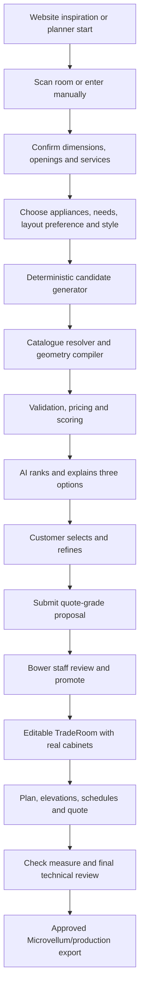

# AI Kitchen Designer and Room Scanner Implementation Plan

**Status:** Proposed canonical implementation plan for the next AI Designer build.

**Last code review:** 2026-07-14.

**Planner:** `bower-kitchen-planner`

**Website:** `bower-cabinet-web-site`

## 0. Executive Decision

Build the improved designer as a constrained design system around the existing kitchen
planner, not as an AI that directly invents cabinet geometry or production data.

The recommended flow is:

1. A customer scans or manually enters the room.
2. A person confirms the dimensions, openings and services.
3. The customer nominates required appliances, layout preferences, style, colours and
   materials.
4. Deterministic code generates and validates a pool of feasible cabinet layouts using
   Bower's real planner catalogue.
5. AI ranks, explains and refines those controlled options.
6. The selected option is compiled again on the server and converted into an editable
   `TradeRoom` containing real `ConfiguredCabinet` records.
7. Bower staff review the design before quote-ready documents are issued.
8. A separate check-measure and approval gate remains mandatory before manufacturing or
   Microvellum export.

The room scanner supplies trusted room facts. The AI supplies design judgement and a
friendly interface. The deterministic engine remains responsible for cabinet selection,
placement, validation, pricing and document dimensions.

## 1. Document Authority

This document is authoritative for the next version of the AI kitchen designer, including:

- customer design briefs;
- cabinet-layout generation and refinement;
- catalogue and material resolution;
- scanner-to-designer use;
- homeowner and trade AI experiences;
- conversion to editable trade rooms;
- design, quote and plan outputs; and
- designer quality gates and delivery order.

`AI-ROOM-SCANNER-MASTER-PLAN.md` remains authoritative for:

- room-capture contracts;
- WebXR, RoomPlan, ARCore and vendor adapters;
- capture accuracy;
- scan confirmation and revision rules;
- secure handoffs;
- private photos/artifacts;
- public endpoint security; and
- scan retention.

Where this plan refers to room scans, it must consume the contracts and security rules from
the scanner master plan without weakening them.

This document supersedes `AI-DESIGNER-HARNESS-PLAN.md` for future designer work. That file
and `AI-DESIGNER-BUILD-STATUS.md` are useful history, but both are physically truncated and
contain stale statements about deployment and current wiring.

## 2. Product Outcome

The target product is an AI-assisted kitchen design workspace that can:

- start from a confirmed room scan or confirmed manual room;
- respect doors, windows, walkways, plumbing, power, gas and hood duct locations;
- capture the household's storage, cooking, appliance, budget and entertaining needs;
- honour a nominated kitchen layout when it fits, or explain why it does not;
- use actual Bower planner cabinets and valid cabinet dimensions;
- apply exact nominated supplier colours/materials where available;
- allow controlled substitutions only when the user permits them;
- produce three meaningfully different, valid design options;
- refine a selected design through typed, undoable operations;
- convert the accepted design into an editable trade room without re-entering cabinets;
- calculate a price band from the existing BOM engine;
- produce a plan, elevations, cabinet schedule, material schedule and quote summary; and
- preserve human review before any production output.

### Product boundary

The system may produce **concept-grade** and **quote-grade** designs from a confirmed scan.
It must not label a scanner-based design as manufacturing-ready. Manufacturing remains
blocked until Bower completes a check measure, reviews appliance installation requirements,
resolves warnings and approves the trade room.

## 3. Verified Current State

### 3.1 Useful foundations already present

| Capability | Current implementation | Reuse decision |
|---|---|---|
| AI design DSL | `src/lib/layout/types.ts`, `schemas.ts` | Extend, do not replace wholesale |
| Deterministic compiler | `compileSpec.ts`, `solveRun.ts`, `geometry.ts` | Keep as the geometry core |
| Layout validation | `validate.ts` | Expand into quote and production readiness levels |
| Four layout strategies | single wall, L, U and galley | Use as candidate families |
| No-AI fallback | `defaultSpecFor()` | Keep as the guaranteed fallback |
| AI endpoint | `supabase/functions/ai-designer/index.ts` | Replace behind a V2 feature flag or versioned endpoint |
| AI homeowner UI | `StepDesign.tsx`, `useAiDesigner.ts` | Extract into a reusable design workspace |
| 3D preview | `UnifiedScene` | Keep for homeowner option review |
| Trade 3D planner | `RoomPlanner`, `PlannerScene` | Destination for accepted designs |
| BOM pricing | `generateQuoteBOM`, `useWizardPricing` | Remain the pricing source of truth |
| Cabinet catalogue | `microvellum_products`, `useCatalog` | Add capabilities and deterministic resolution |
| Supplier materials | `planner-materials.json`, `useMaterialsCatalog` | Use exact stable IDs and DB cost overlay |
| Website style journey | flat-lay generator and `planner_handoffs` | Upgrade the handoff to carry exact IDs |
| Room scan contract | `src/lib/roomScan/contract.ts` | Consume only confirmed scan geometry |
| Plan PDF | `src/lib/planViewPdf.ts` | Extend with room features and elevations |
| Quote/shop outputs | quote PDF, ordering, packing, cut summary, Microvellum XML | Reuse after trade conversion and approval |
| Placement sweep | `npm run ai:sweep` | Extend with V2 catalogue and conversion checks |

The existing placement sweep covers 45,360 combinations and is a valuable regression base.
It proves the current deterministic engine is useful, but it does not prove that AI output,
catalogue resolution, trade conversion, exact material selection or production documents are
correct.

### 3.2 Critical gaps found

| Priority | Finding | Why it matters | Required repair |
|---|---|---|---|
| P0 | Homeowner AI output is saved as `spec` and generic `items`, while trade and Microvellum paths require `design_data.tradeRooms` | Converting a lead only changes its status; it does not create an editable cabinet job | Add a deterministic, server-verified proposal-to-`TradeRoom` promotion path |
| P0 | `finalize` accepts raw specs without proving that those exact specs passed `propose_layout` with zero errors | The prompt states a safety rule that the server does not enforce | Finalize only server-issued proposal IDs/hashes that passed validation |
| P0 | The wizard's `roomShape` is actually a cabinet-layout choice, but L/U layouts are also rendered as an L-shaped physical room | Scanner room geometry and cabinet layout strategy are being conflated | Separate `roomGeometry.shape` from `layoutPreference` everywhere |
| P0 | `buildBrief()` hard-codes 2700 mm height and synthesizes depth for single-wall designs | Confirmed scan height/depth can be discarded or replaced | Build the brief directly from the confirmed canonical room |
| P0 | AI `patch_room` mutates server brief state immediately; client wiring applies only openings/services, not width/depth | Room facts can diverge and confirmed scans can be changed without reconfirmation | Return a proposed room patch, invalidate confirmation, and block design until reconfirmed |
| P0 | Current role resolution maps nine broad roles to static template IDs | The AI does not reliably use the real available Bower cabinet variants | Add catalogue capability metadata and a deterministic resolver |
| P0 | Website handoff carries material names rather than stable catalogue IDs | Similar names can map to the wrong finish, substrate or supplier row | Introduce a versioned exact-ID material selection contract |
| P0 | Homeowner submit still builds a partial `roomScan` stamp and directly inserts a job | The stamp is invalid under the canonical scan schema and bypasses the secure submission path | Complete scanner master plan Phase 1A/1B and submit through the Edge Function |
| P1 | `StyleSpec` covers only exterior finish, benchtop and handle | Door profile, secondary colour, carcase, splashback, kick, tap and handle finish are lost | Add a richer style selection contract |
| P1 | The requested layout shape is fixed before generation | Three AI options can be variations inside the same strategy instead of the best feasible alternatives | Deterministically enumerate allowed strategies, then rank diverse options |
| P1 | Island `features` are stored but not compiled into actual sink/seating/storage behaviour | The preview can claim features that geometry does not implement | Compile each island feature or reject it |
| P1 | There is no reusable trade-side AI panel | Staff cannot use AI to create or improve a real job | Add a shared design workspace with preview, locks, diff and apply |
| P1 | Plan PDF lacks scanner openings/services and there is no wall-elevation design pack | The generated plan is incomplete for review and quoting | Build a deterministic multi-page design pack |
| P1 | Model calls, prompts, revisions and staff corrections are not durably evaluated | Quality cannot be measured or safely improved | Add versioned proposal records, local golden tests and outcome events |
| P2 | The old designer plan proposes learning/trends before the conversion path is complete | It adds complexity before the base product is trustworthy | Defer automated learning until real staff-reviewed outcomes exist |

### 3.3 Deployment statement to verify before implementation

The latest handover contains both "deployed" and "redeploy required" statements for
`ai-designer`. Treat code presence and production deployment as separate facts. Before the
V2 pilot, record the deployed function version, model, prompt version and a successful live
request. Do not infer production state from the repository alone.

## 4. Target Customer-to-Production Journey



### Required customer choices

The customer should be able to nominate each choice as one of:

- `required`: do not change without asking;
- `preferred`: keep where feasible and explain substitutions; or
- `open`: the designer may recommend an option.

This applies to layout strategy, island, appliances, cabinet functions and material/style
selections. A required choice that cannot fit should produce a clear conflict, not a silent
compromise.

## 5. Architecture Principles

1. **Room facts are not design suggestions.** Confirmed dimensions, openings and services
   come from the room contract and cannot be silently changed by AI.
2. **AI expresses intent, not production geometry.** The model selects strategies and typed
   operations. Deterministic code owns positions, dimensions and catalogue resolution.
3. **Exact selections remain exact.** Stable catalogue IDs are preserved through website,
   planner, job, quote and production records.
4. **Every displayed option is reproducible.** A proposal records room revision, brief
   revision, engine version, catalogue version, pricing version and a fingerprint.
5. **Every displayed option passed server checks.** The server, not the prompt, enforces
   schema, catalogue, geometry and pricing requirements.
6. **A room edit invalidates designs.** A changed confirmed room creates an unconfirmed room
   revision and marks existing proposals stale until reconfirmed and recompiled.
7. **A style edit does not invalidate room confirmation.** It increments the design/style
   revision and triggers render/pricing updates only.
8. **Customer and trade surfaces share one core.** UI can differ, but compilation,
   validation, catalogue resolution and pricing cannot fork.
9. **AI output never directly becomes production data.** Staff promotion recompiles and
   validates before writing `tradeRooms`.
10. **Warnings have owners and gates.** A warning must state whether it needs customer
    confirmation, designer review, check measure or a licensed trade decision.

## 6. Target Contracts

The names below are proposed. Final Zod schemas should live beside the existing layout
schemas and be mirrored into the Edge Function through the existing sync workflow.

### 6.1 Room input

Use `ConfirmedRoomScanV1.room` when a confirmed scan exists. For manual entry, produce the
same confirmed room shape through the editor rather than maintaining a second weaker room
contract.

```ts
type DesignerRoomInput = {
  room: RoomSpecV1;
  source: "confirmed-scan" | "confirmed-manual";
  roomRevision: number;
  scanSource?: RoomScanSourceV1;
  confidence?: ConfidenceV1;
  normalizationWarnings?: string[];
};
```

The designer does not receive `adapterState`. Private scan photos are excluded by default.
If an approved future vision feature uses a photo, it receives a short-lived signed URL and
may suggest context only. It must never override confirmed measurements.

### 6.2 Design brief V2

```ts
type RequirementStrength = "required" | "preferred" | "open";

type LayoutStrategy = "single-wall" | "l-shape" | "u-shape" | "galley";

interface DesignBriefV2 {
  schemaVersion: 2;
  roomInput: DesignerRoomInput;
  household: {
    size?: number;
    cooks?: "rare" | "daily" | "entertainer";
    accessibilityNotes?: string;
  };
  priorities: Array<{
    value: "storage" | "bench-space" | "entertaining" | "baking" | "budget";
    strength: RequirementStrength;
  }>;
  appliances: ApplianceRequirementV2[];
  layoutPreference: {
    strength: RequirementStrength;
    preferred?: LayoutStrategy;
    allowed: LayoutStrategy[];
    island: { strength: RequirementStrength; value: "want" | "no" | "if-it-fits" };
  };
  style: StyleSelectionV2;
  budgetBand?: "value" | "mid" | "premium";
  notes?: string;
  briefRevision: number;
}
```

Appliance requirements should carry exact widths and optional model references where known.
Product installation clearances remain explicit data, not facts invented by the model.

### 6.3 Exact material/style selection

```ts
interface CatalogMaterialRefV2 {
  catalogId: string;
  itemCode?: string;
  brand?: string;
  name: string;
  role:
    | "primary-front"
    | "secondary-front"
    | "carcase"
    | "benchtop"
    | "splashback"
    | "handle"
    | "kick"
    | "tap";
  strength: RequirementStrength;
  substitutionPolicy: "exact-only" | "same-range" | "closest-approved";
}

interface StyleSelectionV2 {
  presetId?: string;
  styleTags: string[];
  doorProfileId?: string;
  materials: CatalogMaterialRefV2[];
  notes?: string;
}
```

The ID is authoritative. Name and brand are display/audit fields. If the ID is unavailable,
the resolver follows the declared substitution policy and records the result for approval.

### 6.4 AI design intent

The model should express cabinet needs without selecting arbitrary database rows.

```ts
type CabinetRoleV2 =
  | "sink-base"
  | "cooktop-base"
  | "dishwasher-opening"
  | "drawer-base"
  | "door-base"
  | "bin-base"
  | "corner-base"
  | "wall-storage"
  | "rangehood-wall"
  | "open-shelf"
  | "pantry-tall"
  | "oven-tower"
  | "appliance-tower"
  | "fridge-opening"
  | "filler"
  | "end-panel";

interface CabinetIntentV2 {
  intentId: string;
  role: CabinetRoleV2;
  wall: WallIdV1 | "island";
  sequence: number;
  targetWidthMm?: number;
  strength: RequirementStrength;
  storageFunction?: "cutlery" | "pots" | "pantry" | "bins" | "general";
  applianceRef?: string;
  locked?: boolean;
}

interface DesignIntentV2 {
  strategy: LayoutStrategy;
  cabinetIntents: CabinetIntentV2[];
  island?: {
    requestedLengthMm?: number;
    features: Array<"storage" | "seating" | "sink">;
  };
  rationalePoints: string[];
}
```

### 6.5 Compiled proposal

```ts
interface DesignProposalV2 {
  proposalId: string;
  proposalFingerprint: string;
  roomRevision: number;
  briefRevision: number;
  designRevision: number;
  engineVersion: string;
  catalogVersion: string;
  pricingVersion?: string;
  intent: DesignIntentV2;
  resolvedSpec: KitchenSpecV2;
  items: PlacedItem[];
  priceBand: PriceBand;
  score: DesignScoreV2;
  violations: ViolationV2[];
  substitutions: MaterialSubstitutionV2[];
  rationale: string;
  status: "candidate" | "customer-selected" | "staff-reviewed" | "stale";
}
```

A proposal with any hard error cannot be displayed as selectable. A proposal tied to an old
room or brief revision is stale and cannot be submitted or promoted.

### 6.6 Typed refinement operations

Free-form chat should be translated into a small operation set and then applied by code:

- `move_role`;
- `add_role`;
- `remove_role`;
- `set_role_width`;
- `set_layout_strategy`;
- `set_island`;
- `set_material`;
- `set_door_profile`;
- `lock_component`;
- `unlock_component`; and
- `propose_room_patch`.

`propose_room_patch` is deliberately separate. Applying it increments `roomRevision`, returns
an unconfirmed room and blocks design generation until the person reconfirms it.

## 7. Deterministic Designer V2

### 7.1 Candidate generation before AI ranking

The current AI writes complete run arrays. V2 should first generate feasible candidates in
code:

1. Determine strategies allowed by the room and customer constraints.
2. Enumerate sensible sink, cooktop, fridge and tall-storage wall assignments.
3. Prefer services and windows where appropriate.
4. Add requested appliances and cabinet functions.
5. Solve each run with real catalogue capabilities.
6. Compile geometry.
7. Reject hard errors.
8. Score soft criteria.
9. Remove near-duplicate candidates.
10. Send the best candidate summaries to AI for ranking and explanation.

This makes option quality less dependent on the model and reduces repeated model-tool repair
rounds.

### 7.2 Catalogue capability resolver

`microvellum_products` has useful dimensions and flags, but the designer needs a normalized
capability view. Add a curated capability layer rather than inferring every role from names
at runtime.

Suggested fields:

- `product_id` / `definition_id`;
- `designer_role`;
- `category`;
- allowed or preferred widths;
- resizable/not resizable;
- door and drawer counts;
- sink/corner/blind/appliance flags;
- compatible appliance type and size;
- wall/base/tall mounting class;
- renderable flag;
- priceable flag;
- customer-visible flag;
- trade-visible flag;
- active catalogue version; and
- priority for deterministic selection.

This can start as a versioned TypeScript/JSON mapping for the small approved cabinet set.
Move it into a table only when admin editing is needed. Do not ask the model to choose from
the entire raw product table.

Resolution order:

1. exact approved product for role and requested width;
2. approved product with the nearest allowed width;
3. approved fallback role product;
4. fail the candidate with `catalog-unresolved`.

Every resolved cabinet must exist, render and price before the proposal is selectable.

### 7.3 Expanded compilation

Extend the existing compiler to handle:

- real wall, base, tall and appliance products;
- left/right corner orientation and second-wall dimensions;
- fillers and end panels as actual output records;
- fridge and dishwasher clear openings;
- oven/appliance tower variants;
- bin and drawer functions;
- requested island storage, seating and sink features;
- wall cabinet height around windows and tall units;
- rangehood/duct relationships;
- cabinet locks during refinement; and
- exact exterior/carcase/hardware material IDs on every output item.

### 7.4 Validation levels

Use three explicit validation levels.

**Concept checks:**

- schema valid;
- required roles present;
- no room-boundary or cabinet overlap errors;
- doors/walkways not blocked;
- wall cabinets do not cover windows;
- catalogue products resolve and render; and
- a non-zero price band can be produced.

**Quote readiness checks:**

- appliance openings match nominated appliance dimensions;
- aisle and access rules use Bower-approved configuration values;
- sink/cooktop/fridge relationships are reasonable;
- requested dishwasher, oven, cooktop, fridge and rangehood are represented;
- sink and gas/duct moves are identified;
- ceiling and wall cabinet height fit;
- fillers/end panels are present where needed;
- material IDs are available and priceable;
- substitutions are approved or visibly pending; and
- scanner confidence/normalization warnings are carried into the design pack.

**Production readiness checks:**

- check measure recorded;
- room revision matches the checked room;
- appliance model and installation data confirmed;
- every cabinet has a valid Microvellum link or approved exception;
- cabinet construction prompts are complete;
- all quote warnings are resolved or accepted by staff;
- material availability reviewed; and
- staff approval recorded.

The application should not claim formal building, electrical, gas or plumbing compliance
from AI rules. Any regulated or product-specific rule must come from Bower-approved data and
remain subject to qualified review.

### 7.5 Scoring and option diversity

Hard errors reject a candidate. Soft scoring ranks valid candidates across:

- required/preferred brief satisfaction;
- service movement;
- storage capacity;
- continuous bench space;
- cooking workflow;
- aisle quality;
- appliance accessibility;
- social/island preference;
- estimated price versus budget;
- catalogue confidence; and
- material substitution count.

Return three options only when they are genuinely different. Diversity should be based on
strategy, wall assignment, island use or functional emphasis, not merely a colour change.

## 8. AI Harness V2

### 8.1 Recommended responsibility

AI should:

- interpret natural-language needs;
- convert chat into typed design operations;
- rank valid candidate summaries against the brief;
- explain trade-offs in plain English;
- ask a targeted question when a required choice is ambiguous; and
- summarize what changed after a refinement.

AI should not:

- invent room measurements;
- emit arbitrary product IDs;
- bypass catalogue resolution;
- calculate trusted prices;
- declare its own proposal valid;
- mutate a confirmed room automatically;
- expose raw supplier costs; or
- authorize production.

### 8.2 Enforced tool state machine

Recommended tools:

1. `list_candidate_summaries`
2. `request_candidate_detail`
3. `propose_design_operations`
4. `evaluate_operations`
5. `propose_room_patch`
6. `finalize_proposals`

`evaluate_operations` returns a server-issued `proposalId` and fingerprint only after the
result compiles and has zero hard errors. `finalize_proposals` accepts proposal IDs, not raw
specs. This closes the current validation bypass.

Set tool schemas to strict mode and reject additional properties. Disable parallel tool
calls unless the handler explicitly guarantees ordering. OpenAI currently recommends strict
function schemas for reliable schema adherence; strict objects require all properties to be
declared/required and `additionalProperties: false`.

### 8.3 API migration

Keep the current Chat Completions implementation as the baseline while V2 tests are created.
Then benchmark a migration to the Responses API with a current tool-capable model. Do not
change the model and architecture in the same unmeasured release.

Migration sequence:

1. Freeze a golden set against the current endpoint.
2. Add strict schemas and the proposal-ID state machine.
3. Run the same golden set.
4. Add a Responses API adapter behind `AI_DESIGNER_API_VERSION`.
5. Compare quality, latency, tool failures and cost.
6. Promote only when the acceptance gate passes.

Use a pinned model snapshot in production when repeatability is more important than automatic
upgrades. Record the model and prompt version on every proposal.

### 8.4 Prompt and catalogue context

- Put stable rules first and dynamic room/brief data later.
- Do not inject the full supplier catalogue into the prompt.
- Give the model compact capability/candidate summaries generated by code.
- Treat customer notes, style tags and product names as untrusted data, not instructions.
- Keep prompts versioned in source control.
- Track cached input tokens where a long stable prompt prefix is used.

### 8.5 Reliability and cost controls

- maximum three final options;
- maximum controlled operations per refinement;
- maximum refinement turns per public session;
- durable per-capability and per-IP throttling using the scanner master security helper;
- request timeout and one bounded retry for transient provider errors;
- deterministic fallback always available;
- no image generation during layout generation;
- flat-lay image generated only after a style is selected and only once per style hash; and
- usage, latency and outcome logged without raw private photos or sensitive notes.

## 9. Room Scanner Integration

### 9.1 Designer gate

| Capture state | Designer behaviour |
|---|---|
| `draft` | Show photos/partial information for reference; do not generate from geometry |
| `unconfirmed` | Pre-fill the room editor; require confirmation |
| `confirmed` | Allow candidate generation using `roomScan.room` |
| stale revision | Disable submit/promote and require recompile |

### 9.2 Separate room shape from cabinet layout

This is an immediate repair:

- `roomGeometry.shape` means the physical room shape from the room contract.
- `layoutPreference.preferred` means single wall, L, U or galley cabinet arrangement.
- An L-shaped cabinet arrangement does not make a rectangular room L-shaped.
- Scanner V1 rectangles remain rectangles in 2D, 3D, validation and PDFs.
- True polygon/L-shaped scanned rooms remain a separate milestone in the scanner master plan.

Suggested rename in homeowner state:

```text
roomShape        -> remove as a KitchenShape field
layoutShape      -> layoutPreference.preferred
room             -> canonical RoomSpecV1
```

### 9.3 Scan confidence

Confidence should be visible to staff and present in generated documents. It should not be
used to secretly alter dimensions. A configurable design allowance may reserve extra filler
space for quote-grade proposals, but its amount and application must be explicit and approved
by Bower.

### 9.4 Room refinement

If chat says "the window is wider" or "the plumbing is on the other wall":

1. AI returns `propose_room_patch`.
2. The UI shows the exact room change.
3. The user accepts or rejects it.
4. Acceptance calls the canonical room patch helper.
5. `roomRevision` increments and scan state becomes unconfirmed.
6. Existing proposals become stale.
7. Room confirmation is required.
8. New proposals are generated against the new confirmed revision.

No cabinet/style refinement may smuggle a room patch into the design spec.

## 10. Website Style and Material Handoff

### 10.1 Current problem

The website already has stable flat-lay item IDs, but `createPlannerHandoff()` currently sends
only material names. The planner then converts these names into `styleWords` and asks AI to
choose the nearest small static finish. This loses exact supplier identity.

### 10.2 Versioned handoff upgrade

Do not mutate valid V1 records in place. Add a V2 handoff reader/writer or a versioned design
selection nested contract that carries:

- catalogue ID;
- item code;
- role;
- brand;
- display name;
- selected finish/range when applicable;
- image/texture identity if stable;
- requirement strength; and
- substitution policy.

The website should build this from the selected `FlatLayCatalogItem`, not from rendered text.
The planner verifies the IDs against its synchronized supplier bundle and DB.

### 10.3 Style application

Replace the narrow `StyleSpec` path with a richer resolved style object that supplies:

- primary door/front material;
- optional secondary/accent material;
- internal carcase material;
- door profile;
- benchtop;
- splashback;
- handle product and finish;
- kick material/finish;
- tap/fixture; and
- texture URLs for rendering.

The existing static quick styles can remain as offline starter presets, but each production
preset should resolve to current exact catalogue IDs.

### 10.4 Substitution behaviour

- `exact-only`: block and ask the customer/staff to choose another item.
- `same-range`: choose only another approved finish/substrate in the same range and show it.
- `closest-approved`: suggest one or more alternatives, but do not silently apply one.

All substitutions must appear in the option comparison, quote brief and staff review.

## 11. Conversion to Real Planner Cabinets

### 11.1 Required adapter

Add one pure adapter as the single route from a validated proposal to trade data:

```ts
function proposalToTradeRoom(
  proposal: DesignProposalV2,
  roomDefaults: TradeRoomDefaults,
  catalog: CatalogSnapshot,
): TradeRoom;
```

For every cabinet it must resolve:

- `definitionId`;
- product name/category;
- width, height and depth;
- world position and rotation;
- exterior, carcase and edge material IDs;
- door style;
- handle, hinge and drawer defaults;
- shelves/accessories;
- corner construction fields;
- filler/end-panel prompts;
- cabinet number; and
- source intent/proposal lineage.

The reverse `ConfiguredCabinet -> PlacedItem` mapping already exists in
`useTradeRoomPricing.ts`. Extract shared conversion helpers so the two directions cannot drift.

### 11.2 Staff-only promotion

Replace the current lead conversion, which only changes `status`, with a staff-authenticated
`promote-ai-design` function/RPC:

1. load the stored selected proposal and confirmed room;
2. verify room/brief/proposal revisions and fingerprints;
3. load the pinned or compatible catalogue snapshot;
4. recompile and validate server-side;
5. convert to `TradeRoom`;
6. run quote readiness checks;
7. write `design_data.tradeRooms` and lineage atomically;
8. retain the original customer proposal for audit; and
9. set the job to draft, not approved/production.

Never trust a browser-supplied `TradeRoom` as the production source.

### 11.3 Trade AI workspace

Extract the current homeowner design UI into reusable components and add a trade panel to the
room planner.

Trade modes:

- generate an empty room;
- improve the current room;
- add storage to an available wall;
- revise only unlocked cabinets;
- restyle while preserving layout; and
- explain or critique a current design.

Before applying a change, show a deterministic diff:

- cabinets added/removed;
- cabinets moved/resized;
- product substitutions;
- material/hardware changes;
- price change;
- new/resolved warnings; and
- any room patch requiring reconfirmation.

Apply should be one undoable transaction. Locked cabinets and room facts cannot be altered by
the operation set.

## 12. User Experience

### 12.1 Recommended homeowner flow

1. **Room** - scan or manual capture, then confirm the room.
2. **Needs** - household, priorities and exact appliances.
3. **Preferences** - layout strength, island and exact style/material selections.
4. **Design options** - compare three valid options, select one and refine it.
5. **Review and quote** - plan preview, cabinet summary, materials, warnings and price band.

This is still a five-step journey, but the style is known before final options are presented.
A website handoff can pre-fill step 3.

### 12.2 Option comparison

Each option should display:

- plan thumbnail and 3D preview;
- strategy name;
- why it suits the brief;
- cabinet count and storage emphasis;
- key appliance positions;
- exact selected materials;
- substitutions;
- price band and price source;
- warnings/assumptions; and
- scan confidence label.

Do not present an option whose hard errors are hidden below a warning count.

### 12.3 Refinement

Chat should provide suggestion chips for common controlled operations, while still allowing
natural language. Examples include more drawers, larger pantry, move sink under window, add
island seating and keep the fridge fixed.

Every applied refinement creates a new `designRevision`, retains undo history and shows a
short change summary generated from the deterministic diff.

### 12.4 Degraded operation

The customer must always be able to continue with:

- a confirmed manual room;
- deterministic standard layouts;
- manual style pickers;
- a 3D preview; and
- quote submission.

AI, image generation or WebXR failure must not dead-end the planner.

## 13. Plans, Quotes and Production Outputs

### 13.1 Customer design summary

After selection, provide a shareable summary containing:

- selected layout and rationale;
- top-down plan;
- 3D images;
- cabinet function summary;
- selected style/material board;
- indicative price band;
- assumptions and warnings; and
- clear quote-grade/check-measure wording.

### 13.2 Trade design pack PDF

Extend or compose the existing PDF utilities into a deterministic multi-page pack:

1. cover and job/customer reference;
2. room/scan source, revision, confidence and assumptions;
3. dimensioned floor plan with doors, windows and services;
4. one wall elevation per occupied wall;
5. island elevations where present;
6. cabinet schedule with numbers, product IDs and dimensions;
7. material, door profile, benchtop and hardware schedule;
8. appliance/opening schedule;
9. warnings, substitutions and required decisions; and
10. quote summary or price band appropriate to user role.

All dimensions in the pack must come from the canonical room and compiled cabinet records.
AI may write rationale text but may not draw or calculate plan dimensions.

### 13.3 Existing outputs to reuse

- `planViewPdf.ts` for the plan base;
- `pdfQuoteGenerator` for the trade quote;
- `orderingListPdf.ts`;
- `packingListPdf.ts`;
- `cutSummaryPdf.ts`; and
- `export-microvellum-xml` after approval.

Extend plan output to include openings, swings, windows, service markers, scanner warning
notes and checked-versus-scanned status.

### 13.4 Export readiness gate

Microvellum export remains unavailable until:

- `tradeRooms` exist;
- production readiness validation passes;
- the job is staff approved;
- check measure is recorded;
- required appliance details are confirmed; and
- every cabinet has a valid mapping or approved exception.

## 14. Persistence and Lineage

Use normalized records for AI sessions/proposals while retaining the accepted snapshot in
job `design_data` for operational convenience.

Suggested tables:

### `ai_design_sessions`

- session/customer capability/job link;
- room and brief revision;
- prompt, engine and model versions;
- status and timestamps;
- aggregate token/latency/cost metadata; and
- selected proposal ID.

### `ai_design_proposals`

- proposal ID/fingerprint;
- versioned brief and intent;
- compiled spec/items or durable snapshot reference;
- score, violations and substitutions;
- catalogue/pricing/engine versions;
- customer/staff status; and
- stale/superseded relationship.

### `ai_design_events`

- generated;
- option viewed/selected/rejected;
- refinement requested/applied/undone;
- room patch proposed/accepted/rejected;
- promoted to trade room;
- staff cabinet edits;
- quote issued/accepted; and
- production approval.

Do not build automated trend injection yet. First collect trustworthy staff-reviewed events.

### Job lineage

Store:

- source session/proposal/fingerprint;
- source room revision;
- promoted-at/by;
- staff changes after promotion; and
- check-measure revision.

This permits a staff edit to improve future evaluation without pretending the original AI
proposal was correct.

## 15. Security and Privacy

This plan depends on scanner master plan Phase 1A-min and Phase 1B.

- Retrieve public handoffs only through tokenized Edge Functions.
- Submit enquiries through the atomic Edge Function/RPC.
- Do not restore direct anonymous handoff table reads/writes.
- Use the shared CORS, no-store, body-limit, redaction and throttling helper.
- Require a valid public capability or authenticated staff user for AI calls.
- Require staff authorization for proposal promotion and production exports.
- Keep supplier costs out of public prompts and responses.
- Treat user notes, catalogue text and style tags as untrusted prompt data.
- Exclude private scan artifacts from AI by default.
- Resolve short-lived signed photo URLs only for an approved vision feature.
- Store model request metadata, not unnecessary private image copies.
- Add kill switches for public AI generation, refinement and image generation separately.

## 16. Testing and Acceptance

### 16.1 Deterministic tests

Add scripts that execute in CI:

- `npm run test:design-contracts`;
- `npm run test:design-catalog`;
- `npm run test:design-conversion`;
- `npm run design:sweep`; and
- `npm run design:golden`.

Coverage must include:

- all supported layout strategies;
- common room sizes and fragmented walls;
- every opening/service type;
- required appliance combinations;
- island/no-island cases;
- exact and unavailable materials;
- corner orientation;
- locked cabinet refinement;
- stale room/design revisions;
- proposal-to-trade conversion and reload;
- quote pricing; and
- design pack output data.

### 16.2 Golden design set

Create at least 30 versioned briefs:

- 20 synthetic edge cases;
- 5 anonymized typical Bower kitchens; and
- 5 difficult rooms approved by a Bower designer.

For each brief store expected constraints and human ratings, not one brittle exact layout.

Automated graders should check:

- zero hard violations;
- all required appliances/functions present;
- catalogue and material IDs resolve;
- no unapproved substitutions;
- price band is finite and sourced;
- proposal is reproducible from versions/fingerprint; and
- conversion creates a reloadable trade room.

Human review should rate function, flow, storage, aesthetics, explanation quality and amount
of correction required.

Use the local golden suite as the permanent gate. OpenAI's current guidance recommends
representative test data and explicit criteria for model changes, but the hosted legacy Evals
platform has a published retirement timeline. Do not make that hosted platform a permanent
dependency.

### 16.3 AI operation tests

At least 30 refinement commands should cover:

- more drawers/storage;
- move sink/cooktop/fridge;
- add/remove pantry;
- add/remove island;
- change exact style/material;
- lock a cabinet then revise;
- impossible required choices;
- question-only turns;
- malicious/instruction-like customer notes; and
- room-fact changes requiring reconfirmation.

### 16.4 Acceptance gates

| Gate | Target |
|---|---:|
| Displayed proposals with hard geometry errors | 0 |
| Required appliances/functions represented | 100% |
| Resolved cabinet IDs render and price | 100% |
| Exact selected material IDs preserved or explicitly blocked/substituted | 100% |
| Proposal-to-trade conversion/reload success | 100% |
| Room edit invalidates confirmation and proposals | 100% |
| AI finalize accepts an unvalidated raw spec | 0 cases |
| Public response exposes raw supplier cost | 0 cases |
| Staff can undo an applied AI change | 100% tested cases |
| Three-option generation latency | Track p50/p95; pilot target p95 under 30 seconds |
| Single refinement latency | Track p50/p95; pilot target p95 under 15 seconds |
| Staff-rated usable with minor/no edits | At least 80% before broader release |

### 16.5 Live pilot

Before customer launch:

1. Run at least 10 real Bower kitchen briefs through the full flow.
2. Have staff promote each to a trade room.
3. Compare generated plan and elevations with the editable planner.
4. Record every staff correction.
5. Confirm BOM/quote outputs.
6. Complete one non-production Microvellum round-trip test.
7. Launch behind a feature flag to a small percentage of customers.

## 17. Delivery Phases

### Phase D0: Critical current-state repairs - 3 to 5 days

- Add the document authority banner.
- Record live AI deployment/model/prompt status.
- Fix room-geometry versus layout-preference naming.
- Stop automatic AI room mutation.
- Enforce finalization of only validated proposal IDs.
- Remove the invalid partial room-scan stamp from the new submission path.
- Add baseline tests around the existing endpoint.

**Exit:** current V1 cannot display an unvalidated spec or change a confirmed room silently.

### Phase D1: Designer V2 contracts and catalogue resolver - 5 to 8 days

- Add V2 brief, style, intent, operation, proposal and violation schemas.
- Add approved cabinet capability mapping.
- Resolve roles to real available/visible/renderable/priceable catalogue products.
- Record engine/catalogue versions and proposal fingerprints.
- Update the shared Deno sync list and drift checks.

**Exit:** every generated cabinet is a real approved Bower planner cabinet.

### Phase D2: Candidate generator and validation - 7 to 10 days

- Enumerate feasible strategies and wall assignments.
- Expand island, corner, filler, panel and appliance behaviour.
- Add quote readiness validators and scoring.
- Add option de-duplication/diversity.
- Extend the placement sweep and golden fixtures.

**Exit:** deterministic code can produce/rank valid candidate pools without AI.

### Phase D3: Scanner and exact-style handoff - 5 to 8 days

- Complete scanner master Phase 1A/1B dependencies.
- Map only confirmed room input into `DesignBriefV2`.
- Add room revision/staleness gating.
- Add versioned exact-ID website material selections.
- Resolve full style roles and substitution policy.

**Exit:** a website style selection plus confirmed scan reaches the designer without losing
room or material identity.

### Phase D4: AI harness V2 - 5 to 8 days

- Add strict tool schemas and proposal-ID state machine.
- Translate natural language into typed operations.
- Rank/explain deterministic candidates.
- Add durable session/proposal/event records.
- Benchmark the Responses API/model adapter behind a feature flag.
- Add usage, latency and failure observability.

**Exit:** AI improves judgement and usability without owning validity.

### Phase D5: Homeowner workspace - 5 to 8 days

- Rework the five-step flow.
- Add exact requirements/preferences.
- Build option comparison and clear warnings.
- Add revisioned chat refinement and undo.
- Preserve deterministic fallback.
- Submit through the secure atomic path.

**Exit:** a customer can produce and submit one reproducible quote-grade proposal.

### Phase D6: Trade promotion and AI panel - 7 to 10 days

- Add the pure proposal-to-trade adapter.
- Add staff-only atomic promotion.
- Repair Admin Leads conversion.
- Add trade AI workspace, cabinet locks, diff and transactional apply.
- Persist and reload the generated `tradeRooms`.
- Re-run BOM pricing after promotion.

**Exit:** staff opens the customer design as real editable cabinets with no re-entry.

### Phase D7: Design pack and production gates - 5 to 8 days

- Add openings/services to plan PDF.
- Add wall/island elevations.
- Add cabinet, material and appliance schedules.
- Add scanner confidence, assumptions and substitutions.
- Add check-measure/production readiness state.
- Gate Microvellum export on the completed checks.

**Exit:** staff can issue a coherent quote/design pack and later produce an approved export.

### Phase D8: Pilot and tuning - 5 to 10 days

- Run golden and live Bower pilot kitchens.
- Fix repeated staff corrections in deterministic rules first.
- Tune prompts/model only where the evidence points to model judgement.
- Add feature flag rollout and kill switches.
- Record launch metrics and support procedure.

**Exit:** acceptance gates pass and staff approve customer rollout.

### Indicative total

- Quote-grade MVP through trade conversion: about 6 to 9 working weeks.
- Full design pack and controlled pilot: about 8 to 12 working weeks.
- WebXR scanner discovery/production work remains separately estimated in the scanner master
  plan, although contract, security and planner integration work overlaps.

These estimates assume one experienced implementer working mainly sequentially, existing
Supabase/deployment access and prompt review from a Bower kitchen designer.

## 18. File-by-File Implementation Map

### Existing planner files to extend

- `src/lib/layout/types.ts` - V2 brief, intent, operation and proposal types.
- `src/lib/layout/schemas.ts` - strict runtime schemas.
- `src/lib/layout/catalogRoles.ts` - replace static role-only mapping with approved
  capabilities/resolver input.
- `src/lib/layout/solveRun.ts` - locks, fillers, panels and capability widths.
- `src/lib/layout/compileSpec.ts` - real resolved products, island features and complete
  material fields.
- `src/lib/layout/validate.ts` - concept checks; split quote/production readiness into
  additional modules.
- `src/lib/layout/defaultSpec.ts` - deterministic fallback and candidate seeds.
- `scripts/sync-ai-shared.mjs` - include every new engine module and fail on drift.
- `supabase/functions/ai-designer/index.ts` - V2 state machine or temporary V1 adapter.
- `src/hooks/useAiDesigner.ts` - revision/session-aware client.
- `src/pages/homeowner/Wizard.tsx` - canonical room plus new step order.
- `src/pages/homeowner/steps/StepDesign.tsx` - reduce to a homeowner wrapper around the
  shared workspace.
- `src/pages/homeowner/wizardBrief.ts` - build directly from confirmed room/style contracts.
- `src/data/stylePresets.ts` - exact catalogue-backed presets with static fallback.
- `src/hooks/useMaterialsCatalog.ts` - exact ID verification and role filtering.
- `src/pages/admin/Leads.tsx` - call staff promotion instead of changing status only.
- `src/pages/trade/JobEditor.tsx` - open promoted room and expose AI action.
- `src/pages/trade/RoomPlanner.tsx` - reusable AI panel, locks, diff/apply.
- `src/hooks/useTradeRoomPricing.ts` - extract shared item/cabinet adapters.
- `src/lib/planViewPdf.ts` - features and checked/scanned status.
- `supabase/functions/export-microvellum-xml/index.ts` - production readiness gate.

### Suggested new planner modules

- `src/lib/layout/candidateGenerator.ts`
- `src/lib/layout/catalogResolver.ts`
- `src/lib/layout/designOperations.ts`
- `src/lib/layout/designScore.ts`
- `src/lib/layout/proposalFingerprint.ts`
- `src/lib/layout/validateQuoteReady.ts`
- `src/lib/layout/validateProductionReady.ts`
- `src/lib/layout/tradeAdapter.ts`
- `src/lib/layout/tradeDiff.ts`
- `src/components/design/DesignWorkspace.tsx`
- `src/components/design/DesignOptionCompare.tsx`
- `src/components/design/DesignRefineBar.tsx`
- `src/components/design/TradeDesignDiff.tsx`
- `src/lib/designPackPdf.ts`
- `supabase/functions/promote-ai-design/index.ts`
- `scripts/design-golden.mjs`
- `scripts/design-conversion-smoke.mjs`

### Website files to extend

- `src/lib/dreamweaverBridge.ts` - versioned exact-ID handoff payload.
- `src/pages/showrooms/FlatLayGeneratorPage.tsx` - send selected item IDs and substitution
  policy, not names only.
- `src/types/designScope.ts` - requirement strength and exact material refs.
- `src/lib/plannerUrl.ts` - retain tokenized `/wizard` route.
- generated scanner contract copy and lock/check scripts - remain synchronized with planner.

### Database/functions

- AI session/proposal/event migrations.
- optional cabinet capability table if the TypeScript seed becomes insufficient.
- staff-only promotion RPC/function.
- model/prompt/engine/catalogue version fields.
- production readiness/check-measure fields.
- RLS policies aligned with `app_role` and scanner master plan least privilege.

## 19. First Build Backlog

Implement these in order:

1. Separate physical room geometry from cabinet layout preference.
2. Add a server-tracked validated proposal ID and make `finalize` ID-only.
3. Disable automatic room mutation and add room-patch proposals.
4. Create the V2 brief/style/proposal schemas and tests.
5. Curate the first approved real-cabinet capability map.
6. Build deterministic catalogue resolution and conversion tests.
7. Add `proposalToTradeRoom()` and prove save/reload/BOM pricing.
8. Repair Admin Leads promotion to write `tradeRooms` atomically.
9. Upgrade the website handoff to exact material IDs.
10. Wire confirmed scan rooms into the V2 brief.
11. Add candidate generation, scoring and diversity.
12. Upgrade the AI harness to rank/refine those candidates.
13. Add the trade AI panel and diff/apply workflow.
14. Build plan/elevation design pack output.
15. Run the real-kitchen pilot before broader customer release.

This order produces useful trade conversion early and avoids spending time polishing AI
conversation before the output can become a real cabinet job.

## 20. Deferred Work

Do not include these in the quote-grade MVP:

- model fine-tuning;
- autonomous trend injection;
- automatically publishing customer designs to a gallery;
- AI-generated construction dimensions;
- voice control;
- multi-room optimization;
- non-rectangular scanner geometry beyond the scanner master milestone;
- automatic claims of standards/compliance;
- direct AI access to supplier costs;
- automatic production approval; or
- replacing Microvellum with AI output.

## 21. Definition of Done

The implementation is complete when:

- a confirmed room scan or confirmed manual room is the sole geometry source;
- room shape and cabinet layout strategy are separate concepts;
- exact nominated materials survive the website-to-planner handoff;
- every displayed cabinet resolves to a real, renderable and priceable Bower catalogue item;
- every displayed proposal has a server validation record and fingerprint;
- chat produces typed, undoable operations;
- room changes invalidate confirmation and stale all dependent proposals;
- selected customer proposals promote into editable, reloadable `tradeRooms`;
- trade staff can see and approve a deterministic diff before AI changes apply;
- the BOM engine produces the quote values;
- the design pack includes plan, elevations, schedules, materials and warnings;
- Microvellum export remains blocked until check measure and staff approval;
- deterministic, golden, security and live-pilot gates pass; and
- the planner still works when AI, WebXR or image generation is unavailable.

## 22. External Technical References

- OpenAI function calling and strict schemas:
  https://developers.openai.com/api/docs/guides/function-calling
- OpenAI structured outputs:
  https://developers.openai.com/api/docs/guides/structured-outputs
- OpenAI Responses API migration guide:
  https://developers.openai.com/api/docs/guides/migrate-to-responses
- OpenAI prompt caching:
  https://developers.openai.com/api/docs/guides/prompt-caching
- OpenAI model guidance:
  https://developers.openai.com/api/docs/guides/latest-model
- OpenAI evaluation guidance and current transition notice:
  https://developers.openai.com/api/docs/guides/evals
