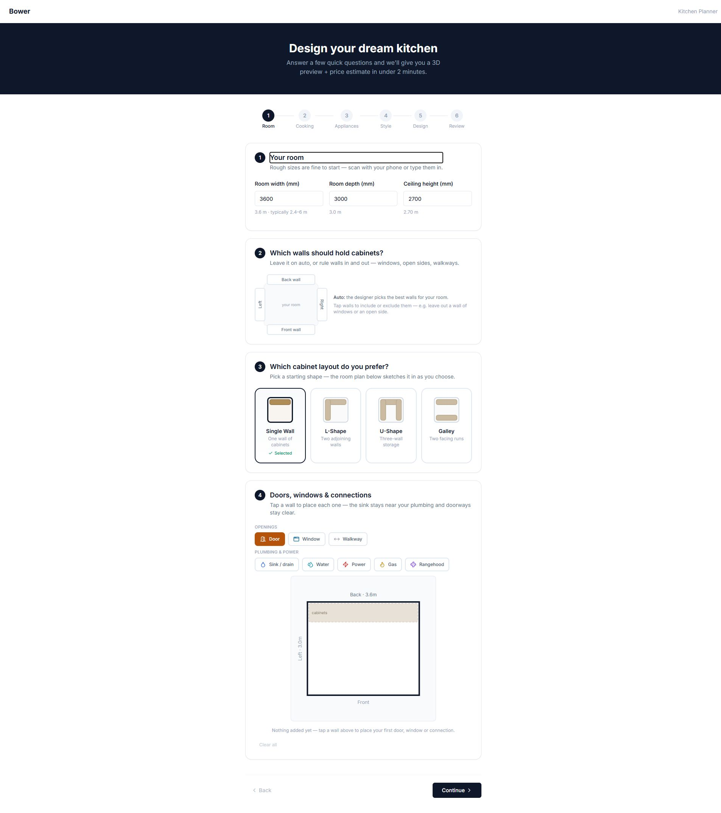
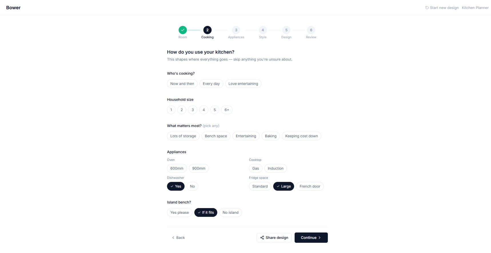
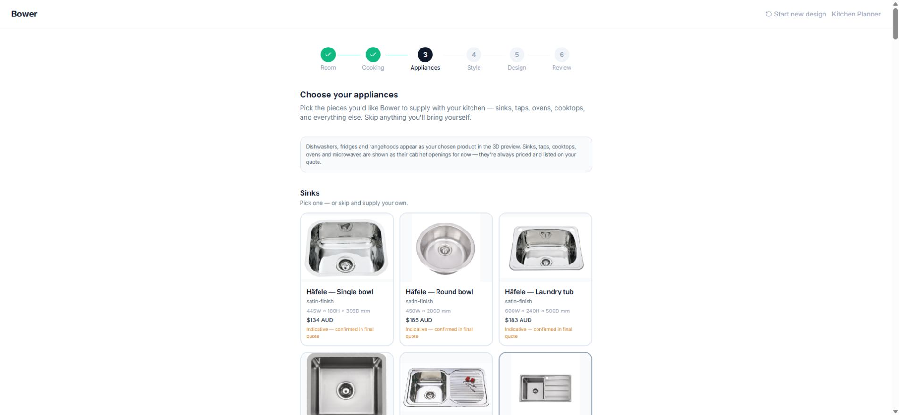
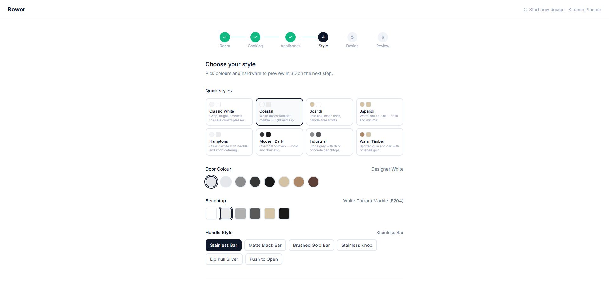
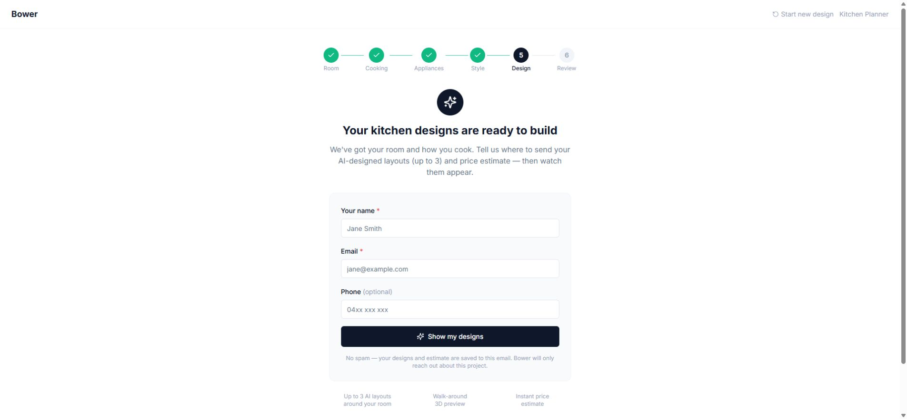
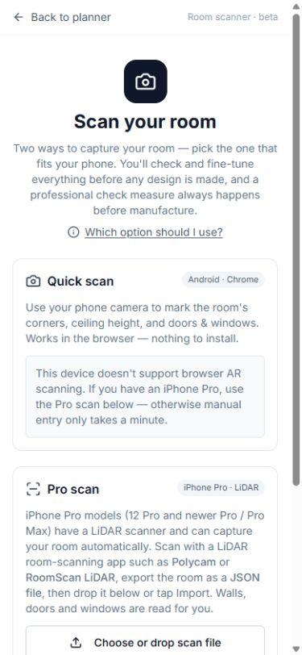
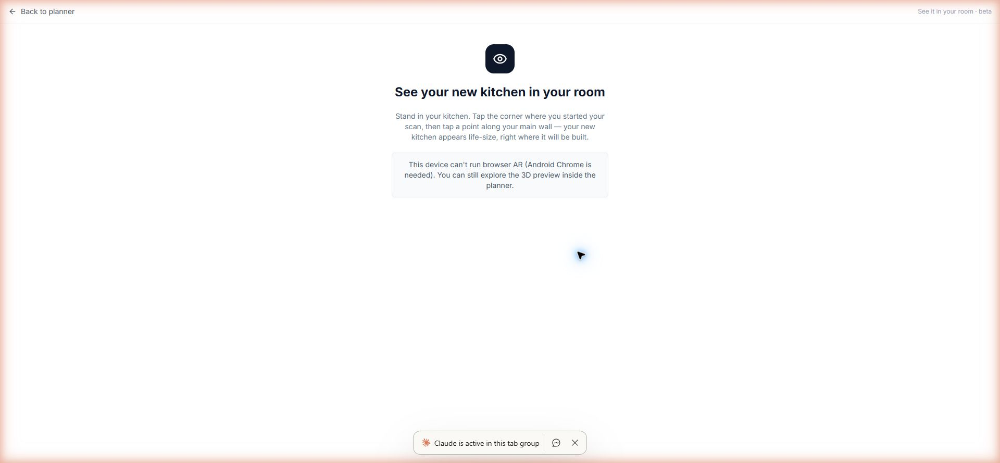

# Bower Kitchen Planner Completion Plan

Date: 30 July 2026  
Goal: turn the existing planner into a credible public lead-generation product without restarting the build.

## Decision

Do not try to finish every advanced feature before launching.

The fastest dependable release is:

1. A polished manual room-to-3D-to-enquiry journey.
2. A smaller, curated cabinet and finish range that looks believable.
3. AI that presents visual alternatives and makes controlled changes.
4. Room scanning and AR kept as clearly labelled beta tools until they pass real-device testing.

This gets the planner collecting leads in roughly **8–12 working days**. A broader polished beta, including scanner and AR hardening, is roughly **another 10–15 working days**.

## Current truth

Verified against local `main`, GitHub, the live planner, and a production build:

- Local `main` is clean and aligned with `origin/main`.
- TypeScript typecheck passes.
- The production build passes.
- The main JavaScript bundle is still large: about 3.02 MB minified / 848 KB gzip.
- Scanner geometry tests pass 35/35.
- Trade AI wiring tests pass 27/27.
- There is no GitHub Actions workflow, so pushes can reach production without an automated release gate.
- Both `planner.bowercabinets.com` and `www.bowercabinets.com` currently redirect unauthenticated visitors to Cloudflare Access. They cannot collect public leads in this state.
- The homeowner journey is live and coherent, but it asks for substantial input before showing any visual value.
- The contact gate appears before the standard layout, AI options, 3D preview, or estimate.
- Contact data entered at the gate is written into funnel analytics metadata, but it does not become a proper lead until the final quote request is submitted.
- AI alternatives are text cards. Customers cannot visually compare the three layouts before choosing one.
- The style picker uses 8 door colours, 6 benchtops, and 6 handle styles represented mainly by flat colours.
- The repo already contains 2,207 supplier material records and more than 2,200 ready material images, but the homeowner style picker does not use them.
- The 3D engine can accept supplier texture URLs at cabinet level, but the homeowner wizard normally supplies flat finish constants instead.
- The appliance step exposes a long product grid. It is technically filtered by prior answers, but it still creates excessive scrolling and choice.
- Scanner contracts and geometry are stronger than the current phone experience. Real Android WebXR use remains the release risk.
- The AR route exists, but unsupported devices reach a mostly blank dead end instead of a useful visual fallback.

## Live journey audit

### 1. Room setup — needs simplification

The first screen combines dimensions, allowed walls, layout shape, and doors/windows/services. It is capable, but it feels like four separate tasks before the customer sees a kitchen.

Health: **Amber** — good underlying controls, too much work at the start.

### 2. Cooking brief — healthy

The questions are understandable and map to useful design constraints. This step should stay, but it can be shortened and combined with layout priorities.

Health: **Green/amber** — clear, but another full page in an already long pre-visual journey.

### 3. Appliance selection — overgrown

Real product imagery and prices improve trust, but the catalogue is too long for a lead funnel. Customers should choose appliance types and a small recommended shortlist first; the full range belongs behind “See more” or in the consultation.

Health: **Amber/red** — useful data, poor decision load.

### 4. Style and board selection — attractive shell, placeholder depth

The screen is clean and easy to understand. The weakness is fidelity: colour dots and approximate material treatments do not provide enough proof for a cabinet purchase.

Health: **Amber** — good interaction model, not yet a convincing material selector.

### 5. AI design entry — main conversion risk

The customer is told the designs are ready before any design has been generated. They must provide contact details before seeing the standard layout, visual alternatives, 3D result, or estimate. This is likely to suppress both trust and completion.

Health: **Red** — the value exchange happens in the wrong order.

### 6. Room scanner — sound concept, device friction

The two-lane explanation is honest, and the mobile layout is readable. On unsupported devices the primary quick-scan card becomes a dead end, while manual entry is below the fold. The Pro path requires a separate iPhone app and JSON export.

Health: **Amber/red** — keep as beta until real-device success is repeatable.

### 7. AR kitchen view — promising but incomplete fallback

The route and positioning concept exist. On an unsupported device the page has almost no useful content after the warning. It should show the normal 3D kitchen, a QR/link to a compatible phone, or a clear return action.

Health: **Amber/red** — promising on supported devices, poor degradation elsewhere.

### 8. Review, quote, and lead handoff — code-backed, not submitted in this audit

The source path creates an enquiry through `submit-planner-enquiry`, stores the room/design/appliance payload, shows an indicative estimate, and routes the job into Admin Leads. A live submission was not made during this audit because that would create a real external lead.

Health: **Amber** — the path exists; it needs a controlled end-to-end launch test and reliable alerting/CRM handling.

## Launch scope

### Must work for the first public lead

- Manual room dimensions and a simple layout choice.
- Doors/windows only when relevant; services can be optional.
- Five to eight curated style packages using real supplier swatches.
- One believable standard 3D layout before asking for contact details.
- Up to three visual AI alternatives after the value preview.
- One consistent estimate everywhere.
- A short quote form that creates exactly one lead.
- A staff-visible lead with source, UTM data, room summary, selected design, estimate, and a reopenable design link.
- Mobile completion without horizontal overflow, traps, or unreadable controls.
- Honest “concept only; professional check measure required” language.

### Beta-only at public launch

- Android room scanning.
- iPhone RoomPlan/JSON import.
- Android WebXR kitchen placement.
- iOS USDZ/Quick Look.

These can remain visible behind “Try beta” labels, but must never block the manual planner or the enquiry path.

### Defer until leads prove demand

- The full factory/Microvellum catalogue in the homeowner journey.
- Manufacturing-ready BOM promises.
- Every room polygon and unusual corner case.
- Advanced per-cabinet production configuration for homeowners.
- Perfect photorealism.
- Full CRM/platform unification if email/Admin Leads can reliably handle the first enquiries.

## Phased delivery plan

### Phase 0 — stop the build loop

Duration: 1–2 working days.

- Create one launch branch and one authoritative completion backlog.
- Freeze new feature work until the launch candidate passes.
- Add GitHub Actions for typecheck, production build, core layout tests, scanner tests, AI contract tests, and pricing tests.
- Require the checks before merging to `main`.
- Separate preview/staging from production. Keep Cloudflare Access on preview, not on the public customer funnel.
- Add feature flags for AI, scanner, Android AR, and iOS AR so one unstable feature cannot block launch.
- Remove names, emails, and phone numbers from analytics metadata.
- Define one release checklist and one rollback commit.

Exit gate: a pull request cannot merge unless the automated release suite is green.

### Phase 1 — make the funnel earn the lead

Duration: 3–5 working days.

- Show a standard 3D concept and rough range before the contact gate.
- Reduce the opening journey to:
  1. Room.
  2. Priorities and appliance types.
  3. Style.
  4. Visual concept.
  5. Quote request.
- Move detailed appliance SKU selection into an optional “Choose exact products” section after the first visual.
- Save contact-gate entries as a proper resumable draft lead, or remove the early gate and collect contact once at quote request.
- Do not repeat the same name/email/phone form twice.
- Add progress, save/resume, and a clear “about 3 minutes” expectation based on the measured flow.
- Track only non-personal funnel events: started, visual shown, AI requested, design chosen, quote submitted, submission failed.

Exit gate: ten test users can reach a useful visual without submitting personal information, and ten test enquiries arrive once each in Admin Leads.

### Phase 2 — curate cabinets and polish the 3D result

Duration: 5–7 working days.

- Create a homeowner catalogue of roughly 20–30 canonical cabinet families:
  base doors, drawer bases, sink base, bin, oven, dishwasher, corners, wall cabinets, rangehood, pantry, fridge, and island.
- Keep the full Microvellum catalogue for trade/admin use.
- Give every homeowner cabinet:
  a clear name, purpose, supported widths, consistent front thumbnail, fit rules, and a stable render recipe.
- Remove semantic duplicates caused by combining dynamic and static catalogue entries.
- Replace flat finish constants with a curated supplier finish model:
  brand, colour name, product/code, swatch image, texture image, grain direction, roughness, and availability.
- Start with 5–8 sellable Bower palettes rather than exposing all 1,986 unique material names.
- Apply the same selected material to the style card, option preview, 3D scene, AR payload, review, and lead record.
- Standardise 3D lighting, camera presets, orbit hints, neutral background, shadow strength, texture scale, end panels, kickboards, fillers, handles, benchtop joins, sinks, cooktops, ovens, fridges, and rangehoods.
- Add stable visual snapshot fixtures for five “golden kitchens.”

Exit gate: every curated style is recognisably different in 3D, woodgrain scale is credible, and the same kitchen renders consistently on desktop and mobile.

### Phase 3 — reshape the AI planner around the intended experience

Duration: 5–7 working days.

- Keep the deterministic engine as the geometry authority; AI ranks and edits valid designs.
- Present each AI alternative as a visual card with:
  thumbnail, layout name, price band, cabinet count, storage/bench summary, and one plain-language reason.
- Add a comparison view before selection.
- Replace open-ended chat as the primary control with safe quick actions:
  more drawers, more bench space, move sink, remove island, add pantry, reduce cost, and swap a cabinet.
- Keep free-text refinement as an advanced option.
- Make “undo” and “start fresh” obvious.
- Ensure generated, selected, refined, review, and submitted designs all use the same proposal, validation rules, pricing band, finishes, and appliances.
- Test five golden rooms plus failure cases: narrow room, openings, L-shape, galley, island/no-island, AI outage, expired session, and invalid refine.
- Correct copy that claims designs are already ready before generation.

Exit gate: three visual alternatives are meaningfully different, every selectable option passes hard rules, and repeated refine/undo/regenerate cycles cannot lose the session or change the price source.

### Phase 4 — harden scanner and AR without blocking launch

Duration: 5–8 working days.

- Make manual entry the default dependable path.
- Put unsupported-device detection before presenting Quick Scan as the primary action.
- Add “Continue manually” above the fold whenever scan support is missing.
- Add a confirmation plan after every scan: dimensions, wall labels, openings, confidence, edit controls, and “needs check” warnings.
- Test Android Quick Scan on a small named device matrix over production HTTPS.
- Test iPhone RoomPlan import with documented apps and real exported files.
- Define a beta accuracy target and record results per wall rather than relying only on schema tests.
- AR must have a useful fallback: embedded 3D, QR/open-on-phone link, and return to design.
- Verify two-point anchoring, scale, orientation, reset/reposition, loss of tracking, reload, and unsupported browsers.
- Keep professional check-measure language visible.

Exit gate: supported-device journeys complete repeatedly in real rooms; unsupported devices always have a useful manual/3D fallback.

### Phase 5 — public lead launch

Duration: 2–3 working days.

- Remove Cloudflare Access from public website and customer planner routes.
- Keep `/admin/*` and `/trade/*` protected by Supabase roles; optionally add a separate Cloudflare policy for staff routes.
- Re-test RLS, public function rate limits, CORS, safe email templates, and submission deduplication before opening the gate.
- Run the full journey from the public website CTA to the planner and Admin Leads.
- Confirm staff notification and response ownership.
- Preserve UTM/referrer/source values with the lead.
- Add a public privacy notice and consent copy appropriate to the data collected.
- Turn on a small traffic source first and review the funnel daily.

Exit gate: an unauthenticated visitor can complete the planner, one enquiry reaches staff with the complete design context, and staff can respond without re-keying the project.

## Definition of launch-ready

- Public customer URLs do not require a Cloudflare PIN.
- Staff routes still reject unauthorised users.
- Typecheck, production build, and the release test suite pass in GitHub.
- No customer PII is stored in analytics events.
- A useful 3D concept appears before the customer is asked for contact details.
- There is one contact/quote submission, not two competing forms.
- Ten consecutive test enquiries arrive exactly once.
- Cabinet, finish, benchtop, appliance, price, and design identity remain consistent from selection through Admin Leads.
- The five golden kitchens pass visual review on desktop and mobile.
- AI failure falls back to a valid standard layout.
- Scanner and AR failures fall back to manual input and normal 3D.
- A tested rollback version is available.

## Recommended delivery order

Start with **Phase 0 and Phase 1**, then release a controlled public lead beta. Complete Phases 2 and 3 immediately behind it. Treat Phase 4 as a parallel beta-hardening stream only after the core funnel is dependable.

This order avoids another build-out loop: every phase ends in a customer-visible outcome and a measurable release gate.

## Evidence limits

- No real enquiry was submitted during this audit, so live lead creation, alerts, and CRM handling still need a controlled test.
- AI generation was not triggered because the live step requires transmitting contact data and may create paid service usage.
- The generated 3D scene could not be visually audited beyond the pre-generation screens without crossing that gate.
- Android WebXR and iPhone AR cannot be validated from a desktop browser; real-device testing is required.
- Screenshot review identifies visible accessibility risks but is not a full keyboard, screen-reader, contrast, or WCAG compliance test.
